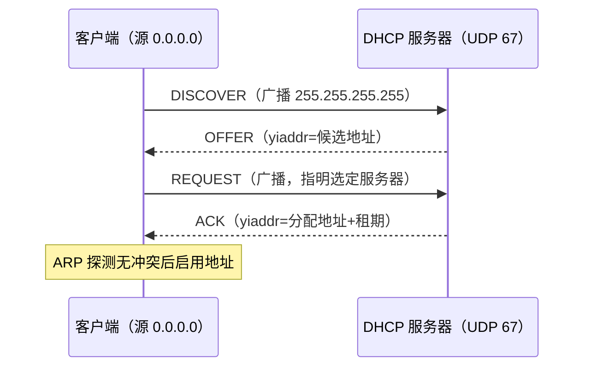

> **位置**：[总索引](/posts/872-index/) ｜ **上游**：[体系结构总览](/posts/872-net-01-architecture/)（应用层地位）
> **下游**：UDP 端口 53/67/68→传输层 06 ｜ 广播地址与路由→网络层 11 ｜ ARP→12 ｜ 全链路填表→13

## 1. 本节考点与考法

| 考法问句 | 题型 | 频次 |
|---|---|---|
| 递归查询与迭代查询的区别？谁替谁跑腿？ | 选择/简答 | 高频 |
| 域名服务器分哪几类？本地域名服务器的地位？ | 简答/选择 | 高频 |
| DNS 用 UDP 还是 TCP？什么情况用 TCP？ | 选择 | 高频陷阱 |
| 资源记录 A/NS/CNAME/MX 各表示什么 | 选择 | 中频 |
| 从输入域名到拿到 IP 的完整解析流程 | 大题/画图 | 高频 |
| DHCP 四步交互，每步报文的源/目的 IP、yiaddr 字段 | 大题填表 | 高频 |
| DHCP 中继代理解决什么问题 | 简答/选择 | 中频 |

## 2. 知识框架

```
DNS  —— 域名空间（树）→ 域名服务器（根/TLD/权限/本地）→ 解析流程（递归/迭代）→ 资源记录
DHCP —— 目的（即插即用）→ 四步 DORA → 报文字段 → 中继代理 → 租期与其他报文
```

- 两个都是应用层、客户-服务器模式的协议：DNS 走 UDP 53（为主），DHCP 走 UDP，服务器 67、客户端 68
- 时序关系：主机入网先经 DHCP（或静态配置）拿到地址，再经 DNS 解析域名，之后才有 HTTP 等会话——综合题里两者的出场顺序经常一起考

## 3. 简答与名词解释

### 必背

- **DNS**：域名系统是因特网使用的命名系统，用来把便于人们使用的机器名字转换为 IP 地址。它是由分层的域名服务器实现的分布式数据库，同时也是一个应用层协议。
- **递归查询 vs 迭代查询**：递归查询中，服务器代替客户端继续向其他服务器查询，最终返回结果或报错；迭代查询中，服务器只返回它认为合适的下一台服务器地址，由客户端（通常是本地域名服务器）自己继续查询。主机对本地域名服务器一般用递归，本地域名服务器对根/顶级/权限服务器一般用迭代。
- **域名服务器四类**：根域名服务器——知道全部顶级域名服务器的地址；顶级域名服务器——管理注册在该顶级域名下的二级域名；权限域名服务器——负责一个区的域名解析；本地域名服务器——主机的 DNS 查询首先发给它，是主机进入 DNS 系统的入口。
- **DHCP**：动态主机配置协议，提供即插即用的主机配置机制，使计算机加入新网络时能自动获取 IP 地址、子网掩码、默认网关、DNS 服务器地址等参数。客户-服务器模式，基于 UDP。
- **DORA 四步**：①DHCPDISCOVER——客户端广播寻找可用服务器；②DHCPOFFER——服务器提供候选配置（含候选地址 yiaddr）；③DHCPREQUEST——客户端广播，指明选定的服务器，同时隐式拒绝其他服务器的提议；④DHCPACK——选定服务器提交绑定并确认，附带租期。

### 辨析

- 资源记录类型：A=域名→IPv4；NS=授权服务器；CNAME=别名→规范名；MX=邮件交换服务器
- DNS 的传输层选择：查询响应用 UDP 53；区域传送（主从服务器同步数据库）用 TCP 53，响应超过 512B 也可能用 TCP
- DHCP 其他报文：NAK=服务器拒绝（客户端网络判断错误或租期失效）；DECLINE=客户端报告地址已被占用；RELEASE=客户端放弃地址；INFORM=客户端已有地址，只要其余参数
- 中继代理：客户端与 DHCP 服务器不在同一网段时，由中继代理（DHCP/BOOTP relay，通常在路由器上）代为转发；服务器根据报文里的 giaddr 判断客户端所在网段，再决定分配哪个地址池的地址

### 了解

- 根域名服务器逻辑上 13 套（a~m），实际在全球多副本部署
- 顶级域名分类：国家/地区域、通用域（com/org/net/edu 等）、反向域 arpa
- 域名缓存：本地域名服务器缓存查询结果，按 TTL 老化，能大幅减少根服务器流量

## 4. 易混对比表

| 维度 | 递归查询 | 迭代查询 |
|---|---|---|
| 谁继续查 | 服务器替客户端继续问 | 客户端自己拿线索继续问 |
| 服务器返回什么 | 最终结果或错误 | 下一台服务器的地址 |
| 典型位置 | 主机 → 本地域名服务器 | 本地域名服务器 → 根/TLD/权限 |
| 服务器负担 | 大（跑完全程） | 小（只答自己管辖的部分） |

| 记录类型 | 含义 | 示例 |
|---|---|---|
| A | 域名 → IPv4 地址 | www.x.edu.cn A 202.x.x.x |
| NS | 该域的授权域名服务器 | x.edu.cn NS dns.x.edu.cn |
| CNAME | 别名 → 规范域名 | www → web1.x.edu.cn |
| MX | 邮件交换服务器 | x.edu.cn MX mail.x.edu.cn |

- DHCP vs 静态配置：静态手工填、无协议交互、管理成本高；DHCP 自动获取、支持即插即用
- DHCP vs ARP：ARP 解决"已知 IP 找 MAC"，DHCP 解决"连 IP 都还没有"。DHCP ACK 之后客户端还会发 ARP 探测地址是否被占用

**DHCP 报文结构（BOOTP 格式，固定 236 B + 选项）**：

| 字段 | 长度 | 作用 |
|---|---|---|
| op | 1 B | 报文类型：1=请求、2=应答 |
| htype | 1 B | 硬件地址类型，以太网 = 1 |
| hlen | 1 B | 硬件地址长度，MAC = 6 |
| hops | 1 B | 经中继代理的跳数 |
| xid | 4 B | 事务 ID，匹配请求与各应答 |
| secs | 2 B | 客户端已用时间 |
| flags | 2 B | 最高位 = 广播标志（BROADCAST） |
| ciaddr | 4 B | 客户端已有 IP（无则 0） |
| yiaddr | 4 B | 服务器分配给客户端的 IP |
| siaddr | 4 B | 下一步引导服务器地址 |
| giaddr | 4 B | 中继代理 IP（跨网段时用） |
| chaddr | 16 B | 客户端硬件地址（MAC） |
| sname | 64 B | 服务器名（可选） |
| file | 128 B | 启动文件名（可选） |
| options | 可变 | 以魔术 cookie `0x63825363` 起始，含子网掩码、网关、DNS、租期等 |

**DNS 报文结构（查询与响应同一格式）**：

| 部分 | 字段 | 长度 | 作用 |
|---|---|---|---|
| 首部 | ID | 16 位 | 标识，匹配查询与响应 |
| 首部 | 标志 | 16 位 | QR（0 查询/1 响应）、Opcode、AA、TC、RD、RA、RCODE |
| 首部 | QDCOUNT | 16 位 | 问题数 |
| 首部 | ANCOUNT | 16 位 | 回答记录数 |
| 首部 | NSCOUNT | 16 位 | 授权记录数 |
| 首部 | ARCOUNT | 16 位 | 附加记录数 |
| 正文 | 问题部分 | 可变 | 查询名 + 查询类型 + 查询类 |
| 正文 | 回答/授权/附加 | 可变 | 若干资源记录 RR：NAME、TYPE、CLASS、TTL、RDLENGTH、RDATA |

## 5. 计算与方法

### DHCP 四步报文字段表（填表题套路）

默认情形：客户端尚无地址、与服务器同网段、报文 BROADCAST 位置 1。

| 步 | 报文 | 源 IP | 目的 IP | yiaddr | UDP 端口 |
|---|---|---|---|---|---|
| 1 | DISCOVER | 0.0.0.0 | 255.255.255.255 | — | 68→67 |
| 2 | OFFER | 服务器 IP | 255.255.255.255（或单播到 yiaddr） | 候选地址 | 67→68 |
| 3 | REQUEST | 0.0.0.0 | 255.255.255.255 | —（选项里带 requested IP） | 68→67 |
| 4 | ACK | 服务器 IP | 255.255.255.255（或单播到 yiaddr） | 分配地址 | 67→68 |

填字段先问三个问题：客户端此刻有没有 IP（没有→源 0.0.0.0）？这步是不是广播（找服务器、或让落选服务器知道已落选→目的 255.255.255.255）？地址字段给谁（yiaddr 只在 OFFER/ACK 出现）？跨网段时中继代理改写 giaddr，IP 层就是普通单播路由。



### DNS 解析全流程（画图题模板）

自编例子：客户端要访问 www.example.com，本地无缓存。

1. 客户端 → 本地域名服务器：递归查询
2. 本地 → 根：迭代，根返回 .com 顶级域名服务器地址
3. 本地 → .com TLD：迭代，返回 example.com 权限服务器地址
4. 本地 → 权限服务器：返回 www.example.com 的 A 记录
5. 本地缓存结果并交给客户端

变式：题面若要求全程递归，则本地服务器把"继续问"交给根服务器逐层代查；有缓存时可直接从命中处继续。画完流程标注每一段用 UDP 53。

## 6. 本节易错点

常见坑：
- "DNS 全用 UDP"：查询用 UDP，区域传送用 TCP
- DISCOVER 源 IP 写 127.0.0.1：是 0.0.0.0
- 默认 OFFER/ACK 一定广播：RFC 按 BROADCAST 位可单播到 yiaddr，按题面条件走
- 递归/迭代说反：先想"谁在替谁跑腿"

---

**出处汇总**：谢希仁《计算机网络（第7版）》第6章；黑书《自顶向下方法》第2章；RFC 1034/1035（DNS）；RFC 2131（DHCP）
