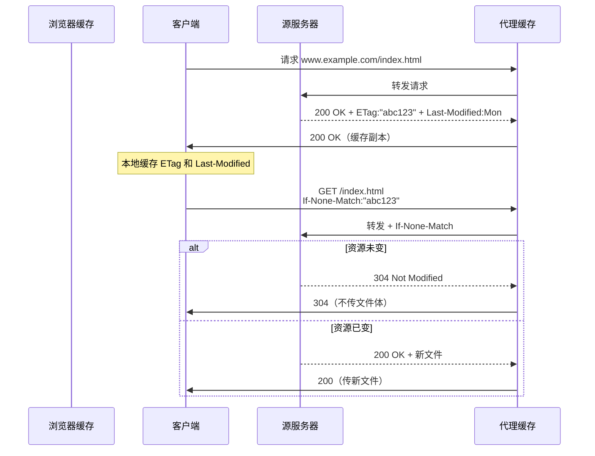

> **位置**：[总索引](/posts/872-index/)｜**上游**：[DNS 与 DHCP](/posts/872-net-02-dns-dhcp/)（域名解析后才有 HTTP）｜**下游**：P2P与邮件（04）｜传输层 06/07/08
>
> **关联**：HTTP 的可靠传输依赖 TCP（net-07/08），HTTPS 的安全机制依赖 TLS 1.3（RFC 8446），Web 缓存与条件 GET 配合 DNS 完成全链路解析。

## 1. 本节考点与考法

| 考法问句 | 题型 | 频次 |
|---|---|---|
| HTTP 持久连接 vs 非持久连接的区别？RTT 如何计算？ | 计算/选择 | ★高频 |
| HTTP 流水线（pipelining）的工作方式？ | 选择 | 高频 |
| GET 与 POST 的区别（安全、缓存、幂等） | 简答/选择 | 高频 |
| Cookie 的工作原理？Set-Cookie 与 Cookie 首部的作用？ | 简答/选择 | 高频 |
| Web 缓存命中如何判断？条件 GET 的两个字段？ | 大题/选择 | ★高频 |
| HTTP 报文格式（请求行/状态行 + 首部行 + 空行 + 实体） | 填表/选择 | 中频 |
| HTTPS 握手过程（TLS 1.2/TLS 1.3 各需几个 RTT） | 简答/选择 | 高频 |
| 常见状态码含义（200/304/404/502 等） | 选择 | 中频 |

## 2. 知识框架

```
HTTP 协议 → 无状态、无连接（早期）→ HTTP/1.1 持久连接默认开启
            ↓
     请求方法：GET/POST/PUT/DELETE/HEAD/OPTIONS/TRACE/CONNECT
            ↓
     报文格式：请求行/状态行 + 首部行 + 空行 + 实体
            ↓
     状态管理：Cookie / Session
            ↓
     缓存机制：代理服务器 + 条件 GET（If-Modified-Since / If-None-Match）
            ↓
     HTTPS：HTTP + TLS → 加密传输（机密性、完整性、认证）
            ↓
     性能优化：持久连接（persistent）→ 流水线（pipelining）→ HTTP/2 多路复用
```

- HTTP 是"请求—响应"模型的应用层协议，工作在 TCP 80 端口；HTTPS 工作在 TCP 443，使用 TLS 加密
- Web 缓存是本节核心综合点：缓存命中 = 304 Not Modified（不需要传送整个文件）

## 3. 简答与名词解释

### 必背

- **HTTP（超文本传输协议）**：超文本传输协议是因特网上应用最广泛的应用层协议，它定义了浏览器如何向万维网服务器请求文档，以及服务器如何把文档传送给浏览器。HTTP 是无状态的，即服务器不保存任何客户端的请求历史。
- **持久连接 vs 非持久连接**：非持久连接每个 TCP 连接只能传送一个对象，传送 N 个对象需要建立 N 个 TCP 连接，总耗时 = N × (2RTT + 传输时间)；持久连接在一个 TCP 连接上可以传送多个对象，HTTP/1.1 默认开启持久连接。
- **HTTP 流水线**：在持久连接基础上，客户端不必等待前一个请求的响应即可发送下一个请求，所有请求像流水线一样并行发出，服务器按顺序返回响应。流水线进一步减少了 RTT 数量，总耗时 = RTT + n × 传输时间（n 为对象数）。
- **Cookie**：HTTP是无状态协议，为实现会话跟踪，服务器在响应首部中加入 Set-Cookie，浏览器后续请求在首部中携带 Cookie 值，服务器据此识别用户身份。Cookie 存储在客户端，有效期由 Expires 字段决定。
- **条件 GET 与缓存命中**：客户端请求时附带 If-Modified-Since（对应响应首部 Last-Modified）或 If-None-Match（对应 ETag），服务器检查资源是否变化，未变化则返回 304 Not Modified，浏览器直接使用本地缓存——这就是缓存命中。
- **HTTPS（安全套接层上的 HTTP）**：HTTPS = HTTP + TLS（传输层安全），在 TCP 443 端口提供机密性（加密）、完整性（MAC）、服务器认证（证书）。TLS 1.3 完整握手只需 1 个 RTT，会话恢复（PSK）可做到 0-RTT。

### 辨析

- **GET vs POST**：GET 请求参数放在 URL 中（?a=1&b=2），POST 放在报文体中；GET 幂等且安全（只读），POST 非幂等且非安全（会产生副作用）；GET 可被缓存，POST 一般不缓存；GET URL 长度受限（浏览器约 2KB），POST 无限制。
- **持久连接 vs 流水线**：持久连接解决"重复建立 TCP"的开销，但请求仍串行；流水线让请求并行，进一步减少等待时间。HTTP/1.1 默认持久但非流水线，流水线需显式开启。
- **Last-Modified vs ETag**：Last-Modified 精确到秒，可能无法区分秒级变化；ETag 是资源的唯一标识（可基于内容哈希），优先级高于 Last-Modified（If-None-Match 优先于 If-Modified-Since）。
- **HTTP vs HTTPS**：HTTP 明文传输，无机密性无完整性；HTTPS 基于 TLS/SSL，提供加密、完整性保护、服务器认证（可选客户端认证）。TLS 1.3 删除了静态 RSA 和 Diffie-Hellman，所有公钥交换均提供前向安全性。

### 了解

- HTTP 方法汇总：GET（获取）、POST（提交）、PUT（上传）、DELETE（删除）、HEAD（仅头部）、OPTIONS（查询能力）、TRACE（回环）、CONNECT（建立隧道）。其中 GET/HEAD/OPTIONS/TRACE 为安全方法。
- 常见状态码：1xx 信息（100 Continue）；2xx 成功（200 OK、204 No Content、206 Partial Content）；3xx 重定向（301 永久移走、302 临时Found、304 Not Modified）；4xx 客户端错误（400 Bad Request、403 Forbidden、404 Not Found）；5xx 服务器错误（500 Internal Server Error、503 Service Unavailable、504 Gateway Timeout）。
- HTTP/2 新特性：多路复用（一个 TCP 连接上并行多个请求/响应）、头部压缩（HPACK）、服务器推送、帧（frame）机制——考试只考概念，不考帧结构。

## 4. 易混对比表

| 维度 | 非持久连接 | 持久非流水线 | 持久流水线 |
|---|---|---|---|
| TCP 连接数 | N 个（每个对象一个） | 1 个 | 1 个 |
| 请求方式 | 串行 | 串行 | 并行（流水线） |
| 总耗时 | N × (2RTT + 传输) | 2RTT + n×传输 | RTT + n×传输 |

| 首部字段 | 作用 | 响应字段 |
|---|---|---|
| If-Modified-Since | 条件 GET：资源在该时间后是否修改 | Last-Modified |
| If-None-Match | 条件 GET：ETag 是否变化 | ETag |
| Cookie | 客户端携带会话标识 | Set-Cookie |
| Cache-Control: no-cache | 强制回源验证 | — |
| Cache-Control: max-age | 缓存有效期（秒） | Age |

| 方法 | 幂等 | 安全 | 缓存 |
|---|---|---|---|
| GET | ✓ | ✓ | ✓（默认） |
| POST | ✗ | ✗ | ✗ |
| PUT | ✓ | ✗ | ✗ |
| DELETE | ✓ | ✗ | ✗ |
| HEAD | ✓ | ✓ | ✓ |

## 5. 计算与方法

### RTT 计算题模板

**触发条件**：题目给出"页面包含 N 个对象（HTML + 图片/脚本/样式）"，"RTT = x ms"，"传输时间 = y ms"，问总下载时间。

**步骤**：
1. 看清是非持久、持久非流水线、还是持久流水线
2. 非持久：N × (2RTT + 传输时间)
3. 持久非流水线：2RTT + N × 传输时间
4. 持久流水线：RTT + N × 传输时间
5. 若问"第一个对象"：持久 = 2RTT + 传输时间，非持久同样

**自编例子**：页面含 1 个 HTML + 4 张图片，RTT = 30ms，每对象传输时间 = 10ms。
- 非持久：5 × (60 + 10) = 350ms
- 持久非流水线：60 + 4×10 = 100ms
- 持久流水线：30 + 4×10 = 70ms

### 缓存命中判定流程

**触发条件**：问"是否需要从服务器获取完整响应"或"返回状态码是什么"。

**步骤**：
1. 浏览器有缓存 → 发请求带 If-Modified-Since 和/或 If-None-Match
2. 服务器检查资源：
   - ETag 不匹配 → 返回 200 + 新资源
   - ETag 匹配 + Last-Modified 更早 → 返回 304 Not Modified（缓存命中）
3. 若浏览器无缓存或服务器判定需更新 → 返回 200



### HTTPS 握手对比（TLS 1.2 vs 1.3）

| 阶段 | TLS 1.2 | TLS 1.3 |
|---|---|---|
| 完整握手 RTT | 2 RTT | 1 RTT |
| 关键消息 | ClientHello → ServerHello + 证书 + ChangeCipherSpec → Finished | ClientHello → ServerHello → Finished |
| 前向安全 | 可选（ECDHE 有，DHE 有，RSA 无） | 必须（删除了静态 RSA/DH） |
| 会话恢复 | Session ID / Ticket | PSK（0-RTT 可选） |
| 0-RTT | 不支持 | 支持（需 PSK，安全性弱） |

**步骤（TLS 1.3 1-RTT 完整握手）**：
1. **ClientHello**：支持的密码套件、签名算法、版本、key_share（ECDHE 公钥）
2. **ServerHello**：选定密码套件、key_share（ECDHE 共享参数）
3. **EncryptedExtensions**：加密的扩展（服务器能力）
4. **Certificate**（可选）：服务器证书
5. **CertificateVerify**（可选）：用私钥签名握手摘要，证明拥有证书私钥
6. **Finished**：用握手密钥对全部握手消息做 MAC，客户端验证
7. 客户端同样发送 Certificate + CertificateVerify + Finished
8. 双方得到主密钥，开始加密传输应用数据

## 6. 本节错题与易错点

- [ ] 待填：今日王道选择错因

常见坑：
- "HTTP 是有状态的"：错，HTTP 本身无状态，Cookie 是应用层机制
- "持久连接就是流水线"：错，持久默认非流水线，需另外开启 pipelining
- 非持久连接 RTT 公式漏乘 N：每个对象都要重新建立 TCP
- 304 响应不传实体，误以为要传
- GET 请求体能带参数：HTTP 规范允许但极少见，题目通常默认参数在 URL
- HTTPS 用 UDP 443：错，HTTPS 仍是 TCP 443，TLS 运行在 TCP 之上

---

**出处汇总**：RFC 7231（HTTP/1.1 方法与状态码）、RFC 7232（条件请求）、RFC 8446（TLS 1.3）；谢希仁《计算机网络》第6章第4-8节；黑书《自顶向下方法》第2章 HTTP 与 Web 性能部分