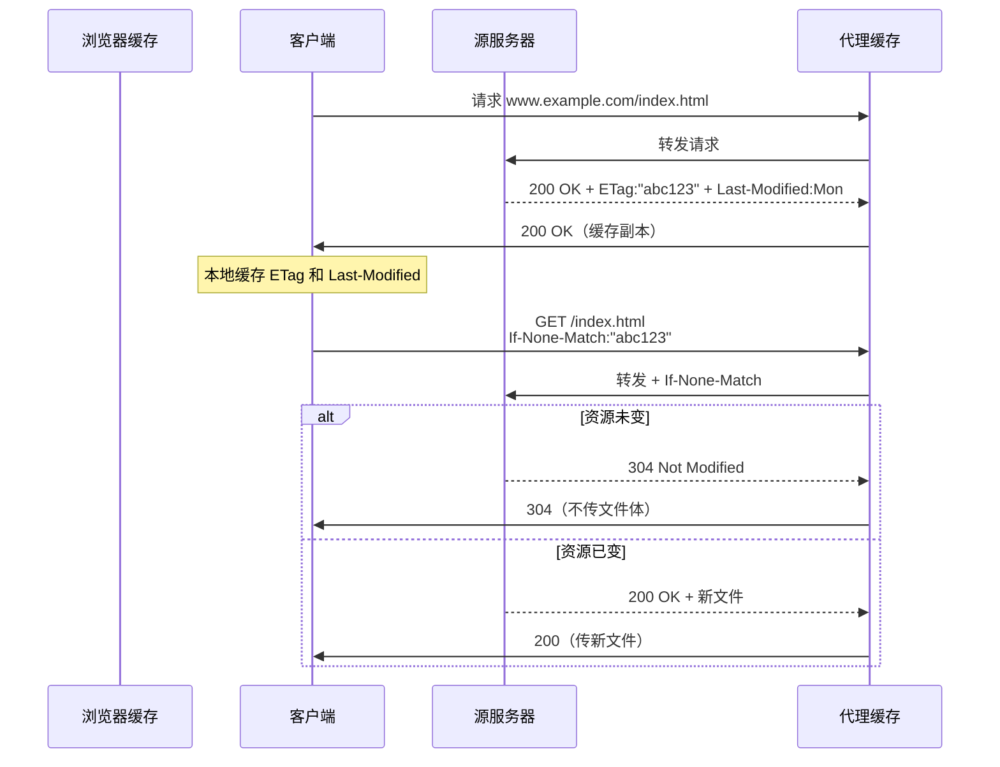

> **位置**：[总索引](/posts/872-index/)｜**上游**：[DNS 与 DHCP](/posts/872-net-02-dns-dhcp/)（域名解析后才有 HTTP）｜**下游**：P2P与邮件（04）｜传输层 06/07/08
>
> **关联**：HTTP 的可靠传输依赖 TCP（net-07/08），HTTPS 的安全机制依赖 TLS 1.3（RFC 8446），Web 缓存与条件 GET 配合 DNS 完成全链路解析。

## 1. 本节考点与考法

| 考法问句 | 题型 | 频次 |
|---|---|---|
| HTTP 持久连接 vs 非持久连接的区别？RTT 如何计算？ | 计算/选择 | ★高频 |
| HTTP 流水线（pipelining）的工作方式？ | 选择 | 高频 |
| GET 与 POST 的区别（安全、缓存、幂等） | 简答/选择 | 高频 |
| Cookie 的工作原理？Set-Cookie 与 Cookie 首部的作用？ | 简答/选择 | 高频 |
| Cookie 与 Session 的区别？Cookie 有哪些属性？ | 简答/选择 | 高频 |
| HTTP/1.0 与 HTTP/1.1 的区别？持久连接何时引入？ | 选择/简答 | ★高频 |
| HTTP/1.1、HTTP/2、HTTP/3 的演进与区别？ | 选择/简答 | 中频 |
| Web 缓存命中如何判断？条件 GET 的两个字段？ | 大题/选择 | ★高频 |
| 强制缓存 vs 协商缓存？Cache-Control 与条件 GET 的关系？ | 简答/选择 | 高频 |
| HTTP 报文格式（请求行/状态行 + 首部行 + 空行 + 实体）与常见首部 | 填表/选择 | 中频 |
| HTTPS 握手过程（TLS 1.2/TLS 1.3 各需几个 RTT） | 简答/选择 | 高频 |
| 常见状态码含义（200/301/304/404/502 等） | 选择 | 中频 |

## 2. 知识框架

```
HTTP 协议 → 无状态、无连接（早期）→ HTTP/1.1 持久连接默认开启
            ↓
     请求方法：GET/POST/PUT/DELETE/HEAD/OPTIONS/TRACE/CONNECT
            ↓
     报文格式：请求行/状态行 + 首部行 + 空行 + 实体
            ↓
     状态管理：Cookie（客户端）/ Session（服务端）→ 会话跟踪
            ↓
     缓存机制：强制缓存（Cache-Control/Expires）
             + 协商缓存（代理服务器 + 条件 GET：If-Modified-Since / If-None-Match）
            ↓
     HTTPS：HTTP + TLS → 加密传输（机密性、完整性、认证）
            ↓
     性能优化：持久连接（persistent）→ 流水线（pipelining）
             → HTTP/2 多路复用（二进制分帧）→ HTTP/3 QUIC（UDP、0-RTT）
```

- HTTP 是"请求—响应"模型的应用层协议，工作在 TCP 80 端口；HTTPS 工作在 TCP 443，使用 TLS 加密
- HTTP 本身**无状态**：服务器不记住两次请求是否来自同一客户；会话跟踪靠 Cookie/Session 在应用层补足
- Web 缓存是本节核心综合点：缓存命中 = 304 Not Modified（不需要传送整个文件）
- 版本主线：**HTTP/1.0 非持久 → HTTP/1.1 持久连接 + 管道化 → HTTP/2 多路复用 → HTTP/3 基于 QUIC/UDP**

## 3. 简答与名词解释

### 必背

- **HTTP（超文本传输协议）**：超文本传输协议是因特网上应用最广泛的应用层协议，它定义了浏览器如何向万维网服务器请求文档，以及服务器如何把文档传送给浏览器。HTTP 是无状态的，即服务器不保存任何客户端的请求历史。
- **持久连接 vs 非持久连接**：非持久连接每个 TCP 连接只能传送一个对象，传送 N 个对象需要建立 N 个 TCP 连接，总耗时 = N × (2RTT + 传输时间)；持久连接在一个 TCP 连接上可以传送多个对象，HTTP/1.1 默认开启持久连接。
- **HTTP 流水线**：在持久连接基础上，客户端不必等待前一个请求的响应即可发送下一个请求，所有请求像流水线一样并行发出，服务器按顺序返回响应。流水线进一步减少了 RTT 数量，总耗时 = RTT + n × 传输时间（n 为对象数）。
- **Cookie（客户端状态）**：HTTP 是无状态协议，服务器无法仅凭连接认出"回头客"。为做会话跟踪，**服务器在响应首部中加入 `Set-Cookie: name=value`** 交给浏览器保存；浏览器此后对**同一域**的每次请求都在请求首部自动带上 `Cookie: name=value`，服务器据此识别用户身份。**Cookie 保存在客户端**（每个约 4KB，可随请求自动携带），默认是会话 Cookie，关闭浏览器即失效；若 `Set-Cookie` 带 `Expires` 或 `Max-Age`，则成为长期有效的持久 Cookie。注意：**服务端并不保存这份 Cookie**，它只负责下发和读取。
- **Session（服务端状态）**：Session 数据保存在**服务器**内存/数据库里，客户端只拿一个 **SessionID**（通常通过 Cookie 携带，也可用 URL 重写、隐藏表单域）。服务器用 SessionID 找到对应的会话数据，从而识别用户。相比 Cookie，Session 能存更大、更敏感的数据，也相对安全；代价是服务器要有状态、占资源，多台服务器还要考虑 Session 共享。
- **Cookie vs Session 一句话**：**Cookie 存"凭证"在客户端，Session 存"档案"在服务端**；Cookie 是 SessionID 的常用载体，但二者不是一回事，也可用 JWT/Token 替代 Session。常见安全属性：`HttpOnly`（禁 JS 读取，防 XSS 窃取）、`Secure`（只走 HTTPS）、`SameSite`（限制跨站携带，防 CSRF）、`Domain`/`Path`（作用域）、`Expires`/`Max-Age`（有效期）。
- **条件 GET 与缓存命中**：客户端请求时附带 If-Modified-Since（对应响应首部 Last-Modified）或 If-None-Match（对应 ETag），服务器检查资源是否变化，未变化则返回 304 Not Modified，浏览器直接使用本地缓存——这就是缓存命中。
- **HTTPS（安全套接层上的 HTTP）**：HTTPS = HTTP + TLS（传输层安全），在 TCP 443 端口提供机密性（加密）、完整性（MAC）、服务器认证（证书）。TLS 1.3 完整握手只需 1 个 RTT，会话恢复（PSK）可做到 0-RTT。
- **HTTP/1.0 与 HTTP/1.1（版本演进，必背）**：HTTP/1.0 **默认非持久连接**——每个请求/响应都要新建并关闭一次 TCP；HTTP/1.1 **默认持久连接（Keep-Alive）**——一个 TCP 连接上可依次承载多个请求/响应，省掉反复三次握手，握手开销与拥塞窗口都得到均摊。HTTP/1.1 是第一个标准化版本，主要新增：①持久连接默认开启（`Connection: close` 可退出）；②**必须带 `Host` 首部**，一台 IP 可托管多个域名（虚拟主机）；③支持**管道化 pipelining**（请求可连续发，响应仍按序回）；④**分块传输 `Transfer-Encoding: chunked`**（长度未知也能边生成边发）；⑤更完善的缓存（`Cache-Control`、`ETag`/`If-None-Match`）与断点续传（`Range`/206）；⑥新增 PUT/DELETE/OPTIONS/TRACE/CONNECT 等方法和 100/206/303/307 等状态码。
- **HTTP/2 与 HTTP/3（了解要点）**：HTTP/2 仍是 TCP，但改为**二进制分帧 + 多路复用**（一条连接并行多个流 stream）、**HPACK 头部压缩**、**服务器推送**，缓解了 HTTP/1.1 的队头阻塞；瓶颈是 TCP 层仍会队头阻塞。HTTP/3 改用 **QUIC（基于 UDP）**，把可靠传输与多路复用做进 QUIC，彻底消除 TCP 层队头阻塞，支持 0-RTT 建连、连接迁移。

### 辨析

- **GET vs POST**：GET 请求参数放在 URL 中（?a=1&b=2），POST 放在报文体中；GET 幂等且安全（只读），POST 非幂等且非安全（会产生副作用）；GET 可被缓存，POST 一般不缓存；GET URL 长度受限（浏览器约 2KB），POST 无限制。
- **持久连接 vs 流水线**：持久连接解决"重复建立 TCP"的开销，但请求仍串行；流水线让请求并行，进一步减少等待时间。HTTP/1.1 默认持久但非流水线，流水线需显式开启。
- **Last-Modified vs ETag**：Last-Modified 精确到秒，可能无法区分秒级变化；ETag 是资源的唯一标识（可基于内容哈希），优先级高于 Last-Modified（If-None-Match 优先于 If-Modified-Since）。
- **HTTP vs HTTPS**：HTTP 明文传输，无机密性无完整性；HTTPS 基于 TLS/SSL，提供加密、完整性保护、服务器认证（可选客户端认证）。TLS 1.3 删除了静态 RSA 和 Diffie-Hellman，所有公钥交换均提供前向安全性。
- **Cookie vs Session**：存储位置——客户端 vs 服务端；容量——约 4KB vs 基本不受限；安全性——Cookie 可被窃取/篡改，Session 更安全；服务器负担——Cookie 无状态省资源 vs Session 有状态占资源、需共享；典型用法——**Cookie 存 SessionID（或 Token），Session 存用户档案**。另见存储型 Cookie（`Expires`/`Max-Age`，持久）与会话 Cookie（无过期，关浏览器失效）。
- **强制缓存 vs 协商缓存**：强制缓存由 `Cache-Control: max-age`（HTTP/1.1，优先级高）或 `Expires`（HTTP/1.0）控制，有效期内**直接读本地副本，根本不发请求**；协商缓存则在本地副本过期后发**条件 GET**（`If-Modified-Since`/`If-None-Match`）向服务器求证，未变返回 **304**（只回头部、不传实体）。口诀：**强缓存不发问，协商缓存要确认**。
- **HTTP/1.0 vs HTTP/1.1**：连接——非持久（每对象新建 TCP）vs 持久默认；首部——无 Host vs 必须有 Host（虚拟主机）；传输——靠 Content-Length 定长 vs 支持 chunked 分块；缓存——Pragma/Expires vs Cache-Control/ETag；性能——无管道 vs 支持管道化。**持久连接是 1.1 引入并设为默认**，这是最常考的差异。

### 了解

- HTTP 方法汇总：GET（获取）、POST（提交）、PUT（上传）、DELETE（删除）、HEAD（仅头部）、OPTIONS（查询能力）、TRACE（回环）、CONNECT（建立隧道）。其中 GET/HEAD/OPTIONS/TRACE 为安全方法。
- **请求报文格式**：请求行（`方法 SP 请求URI SP 版本 CRLF`，如 `GET /index.html HTTP/1.1`）+ 首部行（`字段名: 值`，每行一个）+ **空行（CRLF，标志首部结束）** + 可选请求体。**响应报文格式**：状态行（`版本 SP 状态码 SP 短语`，如 `HTTP/1.1 200 OK`）+ 首部行 + 空行 + 响应体。空行是必考细节，不能漏。
- **常见首部字段**：通用——`Connection`（keep-alive/close）、`Cache-Control`；请求——`Host`（1.1 必带）、`User-Agent`、`Accept`、`Cookie`、`If-Modified-Since`/`If-None-Match`、`Range`；响应——`Server`、`Content-Type`、`Content-Length`、`Set-Cookie`、`Last-Modified`/`ETag`、`Location`（配合 3xx 重定向）、`Transfer-Encoding: chunked`。
- HTTP状态码可按首位数字分类记忆：1xx 信息类表示请求已收到、继续处理；2xx 成功类表示请求正常完成，如 200 成功、201 创建成功、204 成功但无内容；3xx 重定向类表示需要跳转或使用缓存，如 301 永久重定向、302 临时重定向、304 命中协商缓存；4xx 客户端错误类表示请求方有问题，如 400 请求错误、401 未认证、403 禁止访问、404 资源不存在、429 请求过多；5xx 服务器错误类表示服务端或网关有问题，如 500 服务器内部错误、502 网关错误、503 服务暂不可用、504 网关超时。高频重点记住：301 永久重定向、302 临时重定向、304 命中缓存、400 请求错误、403 禁止、404 不存在、500 服务器内部错、502 网关错误、504 网关超时。答题时先看首位定大类，再看具体码判断是重定向、缓存、客户端问题还是服务端/网关问题。
- **HTTP/2 新特性**：多路复用（一个TCP连接上并行多个请求/响应）、头部压缩（HPACK）、服务器推送、帧（frame）机制——考试只考概念，不考帧结构。

## 4. 易混对比表

| 维度 | 非持久连接 | 持久非流水线 | 持久流水线 |
|---|---|---|---|
| 版本 | HTTP/1.0 默认 | HTTP/1.1 默认 | HTTP/1.1 可选 |
| TCP 连接数 | N 个（每个对象一个） | 1 个 | 1 个 |
| 请求方式 | 串行 | 串行（收到响应才发下一个） | 并行（连续发请求） |
| 每个对象耗时 | 2RTT + 传输 | 1RTT + 传输 | 全部引用对象约 1RTT |
| 总耗时（N 个对象） | N × (2RTT + T) | (N+1)RTT + N×T | 3RTT + N×T（含主页） |

| 版本 | 连接 | Host 首部 | 管道化 | 分块传输 | 缓存 | 传输层 |
|---|---|---|---|---|---|---|
| HTTP/1.0 | 非持久（默认） | 可选 | 无 | 无 | Pragma/Expires | TCP |
| HTTP/1.1 | **持久（默认）** | **必需** | 支持 | `chunked` | Cache-Control/ETag | TCP |
| HTTP/2 | 持久 + 多路复用 | 必需 | 被多路复用取代 | 二进制分帧 | 同上 | TCP |
| HTTP/3 | 持久 + 多路复用 | 必需 | — | 二进制分帧 | 同上 | **QUIC/UDP** |

| 对比项 | Cookie | Session |
|---|---|---|
| 存储位置 | 客户端（浏览器） | 服务端（内存/DB） |
| 存什么 | SessionID、少量偏好 | 用户档案、登录态等 |
| 容量 | 约 4KB | 基本不受限 |
| 安全性 | 较低（可窃取/篡改） | 较高（数据不落客户端） |
| 服务器负担 | 无状态、省资源 | 有状态、占资源、需共享 |
| 失效 | Expires/Max-Age 到期 | 会话结束或超时 |

| 首部字段 | 作用 | 响应字段 |
|---|---|---|
| If-Modified-Since | 条件 GET：资源在该时间后是否修改 | Last-Modified |
| If-None-Match | 条件 GET：ETag 是否变化 | ETag |
| Cookie | 客户端携带会话标识 | Set-Cookie |
| Cache-Control: no-cache | 强制回源验证 | — |
| Cache-Control: max-age | 缓存有效期（秒） | Age |

| 方法 | 幂等 | 安全 | 缓存 |
|---|---|---|---|
| GET | ✓ | ✓ | ✓（默认） |
| POST | ✗ | ✗ | ✗ |
| PUT | ✓ | ✗ | ✗ |
| DELETE | ✓ | ✗ | ✗ |
| HEAD | ✓ | ✓ | ✓ |

## 5. 计算与方法

### RTT 计算题模板

**触发条件**：题目给出"页面包含若干对象（1 个 HTML + 若干引用对象）"、"RTT = x ms"、"传输时间 = y ms"，问总下载时间。

**先定口径**（最容易错的地方）：
- 计时从**建立 TCP 连接**开始，还是从**发出 HTTP 请求**开始？前者要额外算 1 个 RTT 建连，后者不算。
- RTT 是**往返时延**：建立 TCP 连接 = 1 RTT；一次"请求/响应" = 1 RTT。
- 记总对象数 \(N\)（含 HTML），单对象传输时间为 \(T\)。

**三句公式**（计时从建立 TCP 连接开始）：
1. 非持久（HTTP/1.0）：每个对象都要"1 RTT 建连 + 1 RTT 请求/响应" → **2N × RTT + N × T**
2. 持久非流水线（HTTP/1.1 默认）：只建 1 次连，N 个对象各 1 RTT → **(N+1) × RTT + N × T**
3. 持久流水线（HTTP/1.1 可选）：1 RTT 建连 + 1 RTT 取 HTML + 1 RTT 取回全部引用对象 → **3 × RTT + N × T**

> 若题目说"从发出 HTTP 请求开始计时"，则上述每种都**减 1 个 RTT**（不用算三次握手）。

**自编例子**：页面含 1 个 HTML + 4 张图片（N = 5），RTT = 30ms，每对象传输时间 T = 10ms，从建立 TCP 连接开始计时。
- 非持久：2×5×30 + 5×10 = 300 + 50 = **350ms**
- 持久非流水线：(5+1)×30 + 5×10 = 180 + 50 = **230ms**
- 持久流水线：3×30 + 5×10 = 90 + 50 = **140ms**

对比可见：持久连接省掉的是**反复建连**，管道化再省掉**逐个等待响应**的 RTT。

### 缓存命中判定流程

**触发条件**：问"是否需要从服务器获取完整响应"或"返回状态码是什么"。

**步骤**：
1. 浏览器有缓存 → 发请求带 If-Modified-Since 和/或 If-None-Match
2. 服务器检查资源：
   - ETag 不匹配 → 返回 200 + 新资源
   - ETag 匹配 + Last-Modified 更早 → 返回 304 Not Modified（缓存命中）
3. 若浏览器无缓存或服务器判定需更新 → 返回 200



### HTTPS 握手对比（TLS 1.2 vs 1.3）

| 阶段 | TLS 1.2 | TLS 1.3 |
|---|---|---|
| 完整握手 RTT | 2 RTT | 1 RTT |
| 关键消息 | ClientHello → ServerHello + 证书 + ChangeCipherSpec → Finished | ClientHello → ServerHello → Finished |
| 前向安全 | 可选（ECDHE 有，DHE 有，RSA 无） | 必须（删除了静态 RSA/DH） |
| 会话恢复 | Session ID / Ticket | PSK（0-RTT 可选） |
| 0-RTT | 不支持 | 支持（需 PSK，安全性弱） |

**步骤（TLS 1.3 1-RTT 完整握手）**：
1. **ClientHello**：支持的密码套件、签名算法、版本、key_share（ECDHE 公钥）
2. **ServerHello**：选定密码套件、key_share（ECDHE 共享参数）
3. **EncryptedExtensions**：加密的扩展（服务器能力）
4. **Certificate**（可选）：服务器证书
5. **CertificateVerify**（可选）：用私钥签名握手摘要，证明拥有证书私钥
6. **Finished**：用握手密钥对全部握手消息做 MAC，客户端验证
7. 客户端同样发送 Certificate + CertificateVerify + Finished
8. 双方得到主密钥，开始加密传输应用数据

## 6. 本节易错点

常见坑：
- "HTTP 是有状态的"：错，HTTP 本身无状态，Cookie 是应用层机制
- "持久连接就是流水线"：错，持久默认非流水线，需另外开启 pipelining
- 非持久连接 RTT 公式漏乘 N：每个对象都要重新建立 TCP
- 304 响应不传实体，误以为要传
- GET 请求体能带参数：HTTP 规范允许但极少见，题目通常默认参数在 URL
- HTTPS 用 UDP 443：错，HTTPS 仍是 TCP 443，TLS 运行在 TCP 之上

---

**出处汇总**：RFC 7231（HTTP/1.1 方法与状态码）、RFC 7232（条件请求）、RFC 8446（TLS 1.3）；谢希仁《计算机网络（第7版）》第6章第4节（6.4 万维网 WWW）；黑书《自顶向下方法》第2章 HTTP 与 Web 性能部分