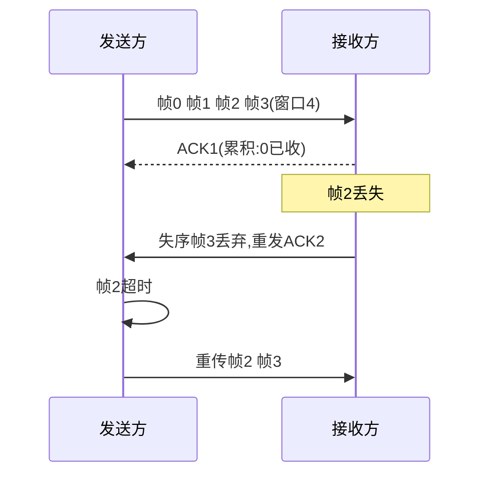

> **位置**：[总索引](/posts/872-index/)｜**上游**：[传输层概述与 UDP](/posts/872-net-06-transport-udp/)｜**下游**：[TCP 连接管理](/posts/872-net-08-tcp-conn/)（08）

## 1. 本节考点与考法

| 考法问句 | 题型 | 频次 |
|---|---|---|
| 序号 n 位时，GBN/SR 的发送窗口最大是多少？ | 计算/选择 | 高频 |
| 收到确认号 N 代表什么含义？ | 选择/计算 | 高频 |
| GBN 与 SR 在确认方式、失序处理上的区别？ | 选择/简答 | 高频 |
| 停等协议信道利用率公式及计算？ | 计算 | 高频 |
| RTTs、RTTd、RTO 如何计算？ | 计算 | 中频 |
| TCP 可靠传输靠哪些机制实现？ | 简答 | 高频 |

## 2. 知识框架

```
可靠传输原理（ARQ 自动重传请求）：校验、序号、确认、重传
  ├─ 停止等待 ARQ：发一帧 → 等确认 → 再发；超时重传
  ├─ 后退 N 帧 GBN：发送窗口 ≥2，接收窗口 =1，累积确认，失序丢弃
  └─ 选择重传 SR：发送窗口 = 接收窗口 >1，逐个确认，失序缓存

TCP 的实现（细节在 07-09 篇展开）：
  序号 = 数据第一个字节的字节编号（字节流编号，非报文段编号）
  确认号 = 期望收到的下一个字节的序号（累积确认）
  超时重传时间 RTO = RTTs + 4×RTTd
```

- 三种协议本质都是**滑动窗口**：窗口越大，信道利用率越高，但序号空间限制了窗口上限
- TCP 确认是**累积确认**，思想接近 GBN；但对失序段的处理和重传策略更灵活（第八篇、第九篇展开）

## 3. 简答与名词解释

### 必背

- **可靠传输的四个机制**：①**校验**：检测传输差错（TCP 有校验和字段）；②**序号**：给数据编号，接收方据此检测丢失、失序、重复；③**确认**：接收方返回 ACK 告知已正确收到的部分；④**重传**：发送方超时未收到确认就重传。四者结合即 ARQ（自动重传请求）。
- **停止等待协议**：发送方每发送一个分组就停止发送，等待确认收到后再发送下一个；若超过重传时间（RTO）未收到确认，就重传上一分组。全双工链路上通过交替使用 0/1 两个序号解决歧义。优点是简单，缺点是信道利用率太低。
- **后退 N 帧协议（GBN）**：发送方无需等确认即可连续发送窗口内的 N 个帧；接收窗口为 1，**只按序接收**，失序帧一律丢弃并重发对最后按序帧的确认。采用**累积确认**：确认号 n 表示 n 及之前的帧全部正确收到。某帧超时后，发送方**重传该帧及其后所有已发送帧**，故称"后退 N 帧"。
- **选择重传协议（SR）**：接收窗口大于 1，对失序到达但落在接收窗口内的帧**先缓存**，等缺失帧补齐后再一并上交；采用**逐个确认**（捎带 ACK 指明具体帧号）。发送方只重传**真正超时或丢失**的那个帧，避免了 GBN 的整窗重传开销，代价是双方都需要更大的缓存和更复杂的逻辑。
- **TCP 的序号与确认号**：TCP 以**字节**为单位编号，首部序号字段指本报文段所发送数据的**第一个字节**的序号；确认号指**期望收到对方下一个报文段的第一个字节的序号**。若确认号 = N，则表示"到 N−1 为止的所有字节已正确收到，请发送序号为 N 及以后的数据"。确认号是**累积确认**语义。
- **RTT 估计与 RTO**：加权平均往返时间 RTTs = (1−α)×旧RTTs + α×新RTT样本，α 推荐 1/8；往返时间偏差 RTTd = (1−β)×旧RTTd + β×|RTTs − 新样本|，β 推荐 1/2（首次取 RTTd = 样本/2）；超时重传时间 **RTO = RTTs + 4×RTTd**。

### 辨析

- **GBN vs SR**：确认方式——GBN 累积确认，SR 逐个确认；失序处理——GBN 丢弃失序帧，SR 缓存失序帧；重传范围——GBN 重传出错帧及其后全部，SR 只重传出错帧；接收窗口——GBN 固定为 1，SR 大于 1；实现难度——SR 缓存和逻辑更复杂。
- **累积确认 vs 逐个确认**：累积确认 ACK n = "n−1 之前全收到"，不必对每个帧单独确认，省带宽但信息模糊（无法告知失序帧已收到）；逐个确认信息精确、利于选择重传，但开销大。TCP 用累积确认。
- **停等 vs 连续 ARQ**：停等发送窗口 = 1，每往返一次只送 1 帧，利用率低；连续 ARQ 窗口 ≥ 2，用流水线方式填满管道，是 GBN/SR 的共同出发点。

### 了解

- Karn 算法：重传的报文段无法判定确认对应哪一次发送，其 RTT 样本不参与 RTTs 估计
- 信道利用率（停等）：U = T_D / (T_D + RTT + T_A)，T_D 为发送一帧的发送时延，T_A 为确认帧的发送时延；忽略 T_A、传播时延远大于发送时延时 U ≈ T_D/RTT
- 连续 ARQ 的利用率：U = W×T_D / (T_D + RTT + T_A)，窗口 W 越大越接近 1，直到受序号空间和拥塞控制限制

## 4. 易混对比表

| 对比项 | 停等 | GBN | SR |
|---|---|---|---|
| 发送窗口 | 1 | 1 < W_T ≤ 2ⁿ−1 | W_T ≤ 2ⁿ⁻¹ |
| 接收窗口 | 1 | 1 | W_R = W_T（≤ 2ⁿ⁻¹） |
| 确认方式 | 逐帧 | 累积确认 | 逐个确认 |
| 失序帧 | —（只按序收） | 丢弃 | 缓存 |
| 重传范围 | 上一帧 | 出错帧及之后全部 | 仅出错帧 |
| 序号需求 | 2 个（1 位） | ≥ W_T + 1 | ≥ W_T + W_R |
| 信道利用率 | 最低 | 较高（重传代价大） | 较高（重传精确） |

> 记法：GBN 是"接收方偷懒"（窗口 1、丢失序），SR 是"接收方干活"（缓存 + 逐个确认）；窗口上限——**GBN 减一，SR 减半**。

| TCP 首部字段 | 含义 | 常见误读 |
|---|---|---|
| 序号 seq | 本段数据第一个字节的编号 | 不是"第几个报文段" |
| 确认号 ack | 期望对方发送的下一个字节序号 | 不是"最后收到的字节序号" |
| ACK 位 | 置 1 时确认号有效 | ACK=1 不等于"已确认全部" |

## 5. 计算与方法

### ① 窗口与序号范围计算（最高频大题）

**触发条件**：给出序号位数 n（或序号取值范围），求某协议最大发送窗口；或给定窗口求最少序号位数。

**步骤**：
1. 写出序号总数 2ⁿ
2. GBN：约束是 **W_T ≤ 2ⁿ − 1**（接收窗口为 1，全部序号中留 1 个区分"新帧"与"旧帧重传"）
3. SR：约束是 **W_T + W_R ≤ 2ⁿ**，且接收窗口一般取 W_R = W_T，故 **W_T ≤ 2ⁿ⁻¹**
4. 反向题：W_T 已知求最小 n——GBN 解 2ⁿ ≥ W_T + 1；SR 解 2ⁿ ≥ 2W_T

**自编例题**：序号 4 位（0~15）。
- GBN 最大发送窗口：2⁴ − 1 = **15**
- SR 最大发送窗口：2⁴⁻¹ = **8**（发送 8 帧 + 缓存 8 帧 = 16 个序号恰好不重叠）

**自编例题 2**：SR 协议发送窗口为 16，最少序号位数？2ⁿ ≥ 2×16 = 32 → n = **5**。

### ② 停等信道利用率

**触发条件**：给出发送速率、帧长、RTT（或单向传播时延）。

**步骤**：
1. T_D = 帧长 / 发送速率；T_A = 确认帧长 / 发送速率（ACK 很短常忽略）
2. U = T_D / (T_D + RTT + T_A)
3. 若问"至少多大窗口才能占满信道"：W ≥ ⌈(T_D + RTT + T_A) / T_D⌉，再与序号上限取小

**自编例题**：1000 km 链路，传播速率 2×10⁸ m/s（RTT = 10 ms），发送速率 1 Mb/s，帧长 1000 B。
T_D = 1000×8 / 10⁶ = 8 ms；U = 8 / (8 + 10) ≈ **44.4%**（忽略确认帧时延）。

### ③ RTT 估计（RTO）

**触发条件**：给出旧 RTTs、旧 RTTd、新 RTT 样本。

**步骤**：
1. 新 RTTs = (7/8)×旧RTTs + (1/8)×新样本
2. 新 RTTd = (1/2)×旧RTTd + (1/2)×|新RTTs − 新样本|
3. 新 RTO = 新RTTs + 4×新RTTd

**自编例题**：旧 RTTs = 100 ms，旧 RTTd = 10 ms，新样本 = 116 ms。
新 RTTs = 87.5 + 14.5 = 102 ms；新 RTTd = 5 + |102−116|/2 = 5 + 7 = 12 ms；RTO = 102 + 48 = **150 ms**。

### ④ TCP 序号 / 确认号计算

**触发条件**：给出报文段序号、数据长度，求下一个报文段的序号或确认号。

**步骤**：
1. 下一报文段序号 = 本段序号 + 本段数据字节数
2. 对方应答确认号 = 本段序号 + 本段数据字节数（"下一个期望字节"）
3. 注意 SYN、FIN 各占一个序号（连接管理篇详述）

**自编例题**：主机 A 发出报文段 seq = 1001，携带 200 B 数据。A 的下一个报文段 seq = 1201；B 应答 ack = **1201**。

### ⑤ GBN 超时流程（Mermaid）



## 6. 本节错题与易错点

- [ ] 待填：今日王道选择+窗口计算错因

常见坑：
- "GBN 发送窗口最大 2ⁿ"：错，是 2ⁿ − 1；SR 才与接收窗口对半分序号空间（2ⁿ⁻¹）
- "SR 发送窗口和接收窗口可以不相等且都取 2ⁿ⁻¹"：错，约束是 W_T + W_R ≤ 2ⁿ；若 W_R < W_T，W_T 可大于 2ⁿ⁻¹，但考题默认 W_R = W_T
- "确认号 N 表示第 N 号字节已收到"：错，表示 N−1 及之前全部收到，N 是**期望的下一个**
- "TCP 序号是报文段的编号"：错，TCP 面向字节流，序号按**字节**编号
- "停等协议无需序号"：错，需要 0/1 交替序号，否则无法区分新帧和超时重传的旧帧
- "RTO 越小越好"：错，RTO 太小引起大量不必要重传，太大则丢帧恢复慢；RTO = RTTs + 4×RTTd 动态调整
- "重传报文段的 RTT 样本可用于估计"：错（Karn 算法），无法区分确认对应原发还是重传
- 计算窗口上限忘"减一/减半"口诀：**GBN 减一，SR 减半**

---
**出处汇总**：RFC 9293（TCP 规范）；谢希仁《计算机网络》第5章第4、6、9节；王道计算机网络第5章可靠传输
