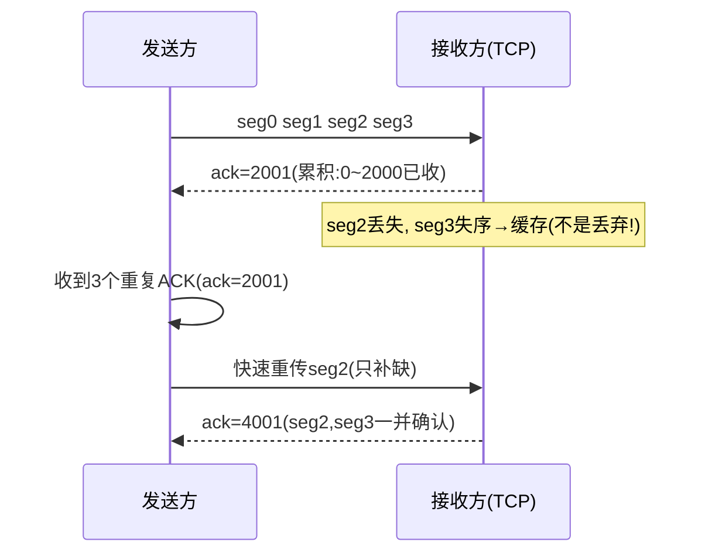

> **位置**：[总索引](/posts/872-index/)｜**上游**：[传输层概述与 UDP](/posts/872-net-06-transport-udp/)｜**下游**：[TCP 连接管理](/posts/872-net-08-tcp-conn/)（08）｜**原理出处**：停等/GBN/SR 的完整原理与推导在[数据链路层](/posts/872-net-14-link/)（14 篇"链路层 ARQ"），本篇只讲 TCP 视角

## 1. 本节考点与考法

> **定位说明**：872 把**停止等待 / GBN / SR 放在数据链路层考**（相邻节点），TCP 是同一套滑动窗口 ARQ 在**端到端**的复用——原理推导（窗口上限证明、失序处理、利用率公式）见 14 篇，本篇聚焦 TCP 的字节流序号、确认与 RTT/RTO。408 考生反过来：主要在本篇补原理，14 篇做对照。

| 考法问句 | 题型 | 频次 |
|---|---|---|
| 序号 n 位时，GBN/SR 的发送窗口最大是多少？ | 计算/选择 | 高频（原理见 14 篇，此处速查） |
| 收到确认号 N 代表什么含义？ | 选择/计算 | 高频 |
| GBN 与 SR 在确认方式、失序处理上的区别？ | 选择/简答 | 高频 |
| 停等协议信道利用率公式及计算？ | 计算 | 高频 |
| RTTs、RTTd、RTO 如何计算？ | 计算 | 中高频 |
| TCP 可靠传输靠哪些机制实现？ | 简答 | 高频 |

## 2. 知识框架

```
可靠传输原理（ARQ 自动重传请求）：校验、序号、确认、重传
  ├─ 停止等待 ARQ：发一帧 → 等确认 → 再发；超时重传        ← 原理主场在链路层（14 篇）
  ├─ 后退 N 帧 GBN：发送窗口 ≥2，接收窗口 =1，累积确认，失序丢弃 ← 同上，窗口上限 2ⁿ−1
  └─ 选择重传 SR：发送窗口 = 接收窗口 >1，逐个确认，失序缓存    ← 同上，窗口上限 2ⁿ⁻¹

TCP 的实现（本篇核心）：
  序号 = 数据第一个字节的字节编号（字节流编号，非报文段编号）
  确认号 = 期望收到的下一个字节的序号（累积确认，思想近 GBN）
  失序段处理灵活：缓存 + SACK 选择性确认（不完全是 GBN/SR 中任何一种）
  超时重传时间 RTO = RTTs + 4×RTTd
```

- 三种协议本质都是**滑动窗口**：窗口越大，信道利用率越高，但序号空间限制了窗口上限（**GBN 减一、SR 减半**，推导见 14 篇 §5⑥）
- TCP 确认是**累积确认**，思想接近 GBN；但失序段会**缓存**（SR 味道），还可借 SACK 精确告知哪段缺失——所以 TCP 是 GBN + SR 的混合体，第八、九篇展开

## 3. 简答与名词解释

### 必背

- **可靠传输的四个机制**：①**校验**：检测传输差错（TCP 有校验和字段）；②**序号**：给数据编号，接收方据此检测丢失、失序、重复；③**确认**：接收方返回 ACK 告知已正确收到的部分；④**重传**：发送方超时未收到确认就重传。四者结合即 ARQ（自动重传请求）。（三协议逐个展开见 14 篇"链路层 ARQ"，此处不重复推导。）
- **TCP 的序号与确认号**：TCP 以**字节**为单位编号，首部序号字段指本报文段所发送数据的**第一个字节**的序号；确认号指**期望收到对方下一个报文段的第一个字节的序号**。若确认号 = N，则表示"到 N−1 为止的所有字节已正确收到，请发送序号为 N 及以后的数据"。确认号是**累积确认**语义。
- **RTT 估计与 RTO**：加权平均往返时间 RTTs = (1−α)×旧RTTs + α×新RTT样本，α 推荐 1/8；往返时间偏差 RTTd = (1−β)×旧RTTd + β×|RTTs − 新样本|，β 推荐 1/2（首次取 RTTd = 样本/2）；超时重传时间 **RTO = RTTs + 4×RTTd**。

### 辨析

- **TCP vs GBN vs SR**：TCP 确认是**累积确认**（GBN 味道），但对失序段**先缓存**（SR 味道），配合 SACK 可精确指明缺失段；重传策略灵活（快速重传只补缺，不必整窗后退）。链路层 GBN/SR 按**帧**编号，TCP 按**字节**编号；链路层窗口受序号空间硬约束，TCP 窗口还受接收缓存 rwnd 与拥塞 cwnd 约束。
- **累积确认 vs 逐个确认**：累积确认 ACK n = "n−1 之前全收到"，不必对每个帧单独确认，省带宽但信息模糊（无法告知失序帧已收到）；逐个确认信息精确、利于选择重传，但开销大。TCP 用累积确认。

### 了解

- Karn 算法：重传的报文段无法判定确认对应哪一次发送，其 RTT 样本不参与 RTTs 估计
- 信道利用率（停等）：U = T_D / (T_D + RTT + T_A)，T_D 为发送一帧的发送时延，T_A 为确认帧的发送时延；忽略 T_A、传播时延远大于发送时延时 U ≈ T_D/RTT
- 连续 ARQ 的利用率：U = W×T_D / (T_D + RTT + T_A)，窗口 W 越大越接近 1，直到受序号空间和拥塞控制限制

## 4. 易混对比表

> 停等/GBN/SR 全维度对比表在 14 篇 §4（链路层主场），此处只留速查与 TCP 对照。

| 对比项 | 停等 | GBN | SR | TCP |
|---|---|---|---|---|
| 编号单位 | 帧（0/1 交替） | 帧 | 帧 | 字节 |
| 发送窗口 | 1 | 1 < W_T ≤ 2ⁿ−1 | W_T ≤ 2ⁿ⁻¹ | 动态（min(rwnd, cwnd)） |
| 确认方式 | 逐帧 | 累积确认 | 逐个确认 | 累积确认（+SACK 可选） |
| 失序段 | — | 丢弃 | 缓存 | 缓存 |
| 重传 | 上一帧 | 出错帧及之后全部 | 仅出错帧 | 超时重传 + 快速重传（只补缺） |

| TCP 首部字段 | 含义 | 常见误读 |
|---|---|---|
| 序号 seq | 本段数据第一个字节的编号 | 不是"第几个报文段" |
| 确认号 ack | 期望对方发送的下一个字节序号 | 不是"最后收到的字节序号" |
| ACK 位 | 置 1 时确认号有效 | ACK=1 不等于"已确认全部" |

**TCP 首部字段速查（固定 20 B，选项最多再 40 B）**：

| 字段 | 长度 | 作用 |
|---|---|---|
| 源端口 | 16 位 | 发送方进程 |
| 目的端口 | 16 位 | 接收方进程 |
| 序号 seq | 32 位 | 本报文段数据第一个字节的编号 |
| 确认号 ack | 32 位 | 期望收到的下一个字节序号 |
| 数据偏移 | 4 位 | 首部长度，以 4 B 为单位，最小 5（20 B） |
| 保留 | 3 位 | 暂未使用 |
| 标志位 | 6 位 | URG / ACK / PSH / RST / SYN / FIN 各 1 位 |
| 窗口 | 16 位 | 接收窗口 rwnd，用于流量控制 |
| 校验和 | 16 位 | 覆盖首部 + 数据 + 伪首部 |
| 紧急指针 | 16 位 | 配合 URG 指出紧急数据末尾 |
| 选项 + 填充 | 可变 | MSS、窗口扩大、SACK、时间戳，4 B 对齐 |

## 5. 计算与方法

### ① 窗口与序号范围计算（最高频大题）

> 完整推导与例题在 14 篇 §5⑥，此处留结论速查。

**结论**：序号 n 位、序号总数 2ⁿ——
- GBN：**W_T ≤ 2ⁿ − 1**（"GBN 减一"）
- SR：**W_T ≤ 2ⁿ⁻¹**（"SR 减半"，默认 W_T = W_R）
- 反向：GBN 解 2ⁿ ≥ W_T + 1；SR 解 2ⁿ ≥ 2W_T

**自编例题**：序号 4 位（0~15）。GBN 最大发送窗口 2⁴ − 1 = **15**；SR 最大发送窗口 2⁴⁻¹ = **8**。

### ② 停等信道利用率

**触发条件**：给出发送速率、帧长、RTT（或单向传播时延）。

**步骤**：
1. T_D = 帧长 / 发送速率；T_A = 确认帧长 / 发送速率（ACK 很短常忽略）
2. U = T_D / (T_D + RTT + T_A)
3. 若问"至少多大窗口才能占满信道"：W ≥ ⌈(T_D + RTT + T_A) / T_D⌉，再与序号上限取小

**自编例题**：1000 km 链路，传播速率 2×10⁸ m/s（RTT = 10 ms），发送速率 1 Mb/s，帧长 1000 B。
T_D = 1000×8 / 10⁶ = 8 ms；U = 8 / (8 + 10) ≈ **44.4%**（忽略确认帧时延）。

### ③ RTT 估计（RTO）

**触发条件**：给出旧 RTTs、旧 RTTd、新 RTT 样本。

**步骤**：
1. 新 RTTs = (7/8)×旧RTTs + (1/8)×新样本
2. 新 RTTd = (1/2)×旧RTTd + (1/2)×|新RTTs − 新样本|
3. 新 RTO = 新RTTs + 4×新RTTd

**自编例题**：旧 RTTs = 100 ms，旧 RTTd = 10 ms，新样本 = 116 ms。
新 RTTs = 87.5 + 14.5 = 102 ms；新 RTTd = 5 + |102−116|/2 = 5 + 7 = 12 ms；RTO = 102 + 48 = **150 ms**。

### ④ TCP 序号 / 确认号计算

**触发条件**：给出报文段序号、数据长度，求下一个报文段的序号或确认号。

**步骤**：
1. 下一报文段序号 = 本段序号 + 本段数据字节数
2. 对方应答确认号 = 本段序号 + 本段数据字节数（"下一个期望字节"）
3. 注意 SYN、FIN 各占一个序号（连接管理篇详述）

**自编例题**：主机 A 发出报文段 seq = 1001，携带 200 B 数据。A 的下一个报文段 seq = 1201；B 应答 ack = **1201**。

### ⑤ TCP 累积确认 + 失序缓存流程（Mermaid）



TCP 与 GBN 的关键差异就在这：失序段**缓存不丢弃**，且收到重复 ACK 可触发**快速重传**只补缺，不必像 GBN 整窗后退。

## 6. 本节易错点

常见坑：
- "GBN 发送窗口最大 2ⁿ"：错，是 2ⁿ − 1；SR 才与接收窗口对半分序号空间（2ⁿ⁻¹）
- "SR 发送窗口和接收窗口可以不相等且都取 2ⁿ⁻¹"：错，约束是 W_T + W_R ≤ 2ⁿ；若 W_R < W_T，W_T 可大于 2ⁿ⁻¹，但考题默认 W_R = W_T
- "确认号 N 表示第 N 号字节已收到"：错，表示 N−1 及之前全部收到，N 是**期望的下一个**
- "TCP 序号是报文段的编号"：错，TCP 面向字节流，序号按**字节**编号
- "TCP 失序段像 GBN 一样丢弃"：错，TCP 缓存失序段（SR 味道），累积确认只是确认语义像 GBN
- "停等协议无需序号"：错，需要 0/1 交替序号，否则无法区分新帧和超时重传的旧帧
- "RTO 越小越好"：错，RTO 太小引起大量不必要重传，太大则丢帧恢复慢；RTO = RTTs + 4×RTTd 动态调整
- "重传报文段的 RTT 样本可用于估计"：错（Karn 算法），无法区分确认对应原发还是重传
- 计算窗口上限忘"减一/减半"口诀：**GBN 减一，SR 减半**

---
**出处汇总**：RFC 9293（TCP 规范）；谢希仁《计算机网络（第7版）》第5章（5.4 可靠传输：停止等待与连续 ARQ，原理与链路层一致）、第6节（5.6 TCP 可靠传输与滑动窗口）；王道计算机网络第5章可靠传输
