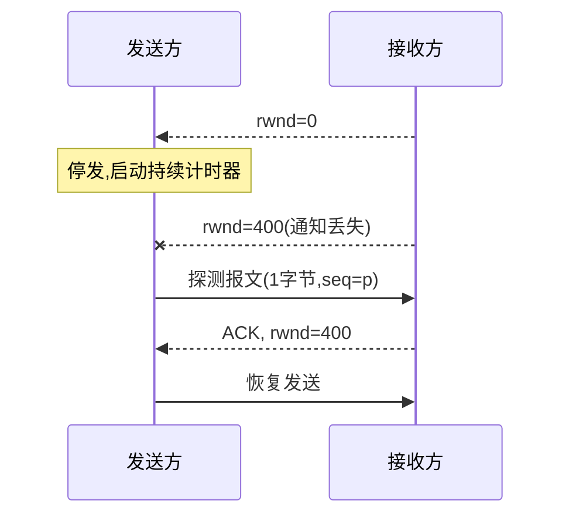

> **位置**：[总索引](/posts/872-index/)｜**上游**：[TCP 可靠传输](/posts/872-net-07-tcp-reliable/)｜**下游**：[TCP 拥塞控制](/posts/872-net-09-congestion/)（09）

## 1. 本节考点与考法

| 考法问句 | 题型 | 频次 |
|---|---|---|
| 为什么握手是三次、挥手是四次？ | 简答 | 极高频 |
| SYN 洪泛攻击是什么？SYN cookie 如何防御？ | 简答/选择 | 中频 |
| TIME_WAIT 为什么要等 2MSL？ | 简答 | 高频 |
| FIN/ACK/SYN 各占几个序号？序号计算 | 计算 | 高频 |
| 流量控制如何实现？零窗口怎么办？ | 简答/选择 | 高频 |
| 给定场景判断 TCP 状态（SYN_SENT/FIN_WAIT 等） | 选择 | 高频 |

## 2. 知识框架

```
连接建立（三次握手）                    连接释放（四次挥手）
  A: SYN=1, seq=x            →          A: FIN=1, seq=u
  B: SYN=1, ACK=1, seq=y, ack=x+1       B: ACK=1, seq=v, ack=u+1
  A: ACK=1, seq=x+1, ack=y+1            B: FIN=1, ACK=1, seq=w, ack=u+1
     → ESTABLISHED                         A: ACK=1, seq=u+1, ack=w+1
                                           → A: TIME_WAIT 等 2MSL → CLOSED

三次握手原因：防止"失效的连接请求报文段"突然又传到 B，产生错误连接与资源浪费
四次挥手原因：TCP 全双工，两个方向的数据要分别关闭（B 可能还有数据要发）

流量控制：
  接收窗口 rwnd —— 接收方通过首部"窗口"字段通告自己的接收能力
  发送窗口 ≤ min(rwnd, cwnd)（cwnd 见 09 篇拥塞控制）
  零窗口 → 发送方停止 → 启动持续计时器 → 收到零窗口通知后计时器到 → 发 1B 探测报文
```

- 握手阶段 **SYN=1 的报文段不能携带数据但消耗一个序号**；ACK=1 的确认报文若不带数据则不消耗序号
- 挥手阶段 **FIN=1 也消耗一个序号**，即使不带数据

## 3. 简答与名词解释

### 必背

- **三次握手**：①客户端发 **SYN=1、seq=x** 的连接请求报文段，进入 SYN_SENT；②服务器回 **SYN=1、ACK=1、seq=y、ack=x+1**，进入 SYN_RCVD；③客户端再发 **ACK=1、seq=x+1、ack=y+1**，进入 ESTABLISHED，服务器收到后也进入 ESTABLISHED。第三次握手可以携带数据。若只两次握手，失效的旧连接请求到达服务器后服务器单方面建立连接并等待数据，造成资源浪费，故需要第三次确认。
- **四次挥手**：①数据传完后客户端发 **FIN=1、seq=u**，进入 FIN_WAIT_1；②服务器回 **ACK=1、ack=u+1**，进入 CLOSE_WAIT，客户端收到后进入 FIN_WAIT_2——此时半关闭，A→B 方向已关闭但 B 仍可发数据；③服务器数据发完后再发 **FIN=1、ACK=1、seq=w、ack=u+1**，进入 LAST_ACK；④客户端回 **ACK=1、ack=w+1**，进入 TIME_WAIT，等 **2MSL** 后关闭，服务器收到 ACK 即关闭。挥手之所以四次，是因为服务器收到 FIN 时可能还有数据要发，ACK 和 FIN 分开发送。
- **TIME_WAIT = 2MSL**：MSL（最长报文段寿命）是一个报文段在网络中可存活的最长时间。主动关闭方在发出最后一个 ACK 后须等 2MSL：①保证最后这个 ACK 若丢失，能在 MSL 内收到对方重传的 FIN 并再次应答（一去一回恰好 2MSL）；②让本连接产生的所有报文段在网络中消逝，避免旧连接的报文串扰到用相同端口号的新连接。
- **TCP 流量控制**：流量控制是**点对点**的，目的是让发送速率不超过**接收方**的处理能力。实现机制是滑动窗口：接收方通过报文段首部的**窗口字段**把自己的接收窗口 rwnd 通告给对方，发送方的发送窗口不得超过 rwnd，从而动态调节发送速率。
- **零窗口与持续计时器**：接收方通告 rwnd=0 时发送方停止发送。之后接收方缓存放空发出 rwnd>0 的通知，**若该通知丢失**，双方将互相死等。为此发送方设**持续计时器**：超时后发送一个**只携带 1 字节数据的零窗口探测报文段**，接收方回应当前窗口值；探测报文即使丢失，也有超时重传兜底，死锁得以打破。

### 辨析

- **流量控制 vs 拥塞控制**：流量控制是**端到端**问题，抑制发送方保护**接收方**（依据 rwnd）；拥塞控制是**全局**问题，防止过多数据注入**网络**（依据 cwnd，见 09 篇）。发送窗口取 min(rwnd, cwnd)，两者同时起作用。
- **半关闭 vs 半打开**：半关闭指连接一端已发 FIN（一个方向关闭）但另一方向仍可传输数据——四次挥手中间的正常状态；半打开指一端崩溃/重启后另一端并不知情，连接处于异常状态，需靠保活或探测定期处理。
- **SYN 洪泛 vs SYN cookie**：SYN 洪泛攻击是攻击者伪造大量 SYN 请求但不回第三次 ACK，服务器半连接队列被占满，拒绝正常服务；SYN cookie 防御思路是服务器不为半连接分配资源，把连接信息**编码进初始序号 y** 返回，收到第三次 ACK 时用 cookie 验证合法性后再分配资源。
- **SYN 消耗序号 vs ACK 不消耗**：SYN=1 和 FIN=1 的报文段即使不携带数据也**各消耗一个序号**（因为要被确认）；纯 ACK 报文段不带数据时不消耗序号——这是握手/挥手序号计算题的核心。

### 了解

- 保活计时器：服务器 2 小时无数据交互则每 75 s 发探测报文，连续 10 次无响应则关闭连接，处理"半打开"状态
- TCP 状态迁移要点：主动打开 SYN_SENT → ESTABLISHED；被动打开 LISTEN → SYN_RCVD → ESTABLISHED；主动关闭 FIN_WAIT_1 → FIN_WAIT_2 → TIME_WAIT → CLOSED；被动关闭 CLOSE_WAIT → LAST_ACK → CLOSED
- 同时打开/同时关闭：两端同时发 SYN（或 FIN）的极端情形，状态走特殊路径，考试偶见选择题

## 4. 易混对比表

| 握手/挥手报文 | 标志位 | 能否携带数据 | 消耗序号？ |
|---|---|---|---|
| 第一次握手 | SYN=1 | 否 | 是（1 个） |
| 第二次握手 | SYN=1, ACK=1 | 否 | 是（1 个） |
| 第三次握手 | ACK=1 | 可以 | 带数据才消耗 |
| 第一次挥手 | FIN=1 | 可以 | 是（1 个） |
| 之后的 ACK/FIN | ACK=1 / FIN=1 | FIN 可带 | FIN 消耗 |

| 主动关闭方状态迁移 | 含义 |
|---|---|
| ESTABLISHED → FIN_WAIT_1 | 发出 FIN，等对方 ACK |
| FIN_WAIT_1 → FIN_WAIT_2 | 收到 ACK，等待对方 FIN（半关闭） |
| FIN_WAIT_2 → TIME_WAIT | 收到对方 FIN，回最后一个 ACK |
| TIME_WAIT → CLOSED | 等满 2MSL |

| 接收方窗口通告 | 发送方行为 |
|---|---|
| rwnd > 0 | 按窗口持续发送 |
| rwnd = 0 | 停止发送，启动持续计时器 |
| 收到新通知 rwnd > 0 | 恢复发送 |
| 通知丢失 | 计时器超时 → 发 1B 探测报文 → 收当前窗口值 |

> 记法：握手"两推一拉"（请求、应答+请求、确认）；挥手"各关各的方向"所以四次；**SYN、FIN 吃序号，ACK 不吃**。

## 5. 计算与方法

### ① 握手/挥手序号推算（高频计算题）

**触发条件**：给出某一方初始序号或某报文段 seq/ack，推后续报文段的 seq/ack。

**步骤**：
1. 客户端 SYN 段：seq = x，**不携带数据也占 1 个序号** → 客户端下一个可用序号 x+1
2. 服务器 SYN+ACK 段：seq = y，占 1 个序号 → ack = x+1；客户端回 ACK：seq = x+1, ack = y+1
3. 连接建立后第一个数据段：客户端 seq = x+1（若第三次握手不带数据）
4. FIN 段同理：FIN=1 占 1 个序号；对 FIN 的确认 ack = 对方最后序号 + 数据长 + 1
5. 数据段序号推进：下一 seq = 本段 seq + 本段字节数（字节流编号，联动 07 篇）

**自编例题**：A 初始序号 1000，B 初始序号 5000。
- 第一次握手：A→B：SYN=1, seq=1000
- 第二次握手：B→A：SYN=1, ACK=1, seq=5000, ack=1001
- 第三次握手：A→B：ACK=1, seq=1001, ack=5001
- 建立后 A 发送 100 B 数据段：seq=1001，数据 1001~1100；B 应答 ack=**1101**

### ② FIN 确认序号计算

**自编例题**：B 已发数据到序号 7999（即最后字节 7998），现发 FIN（seq=7999，不带数据）。
- FIN 占 7999 这一个序号
- A 应答：ACK=1, seq=A当前序号, ack=**8000**（"8000 之前全部收到，包括 FIN"）

### ③ 零窗口探测流程（Mermaid）



### ④ 状态判断题方法

**触发条件**：题干描述"某端发出/收到某报文段"，问当前状态。

**步骤**：按"谁主动"分两条主线：
1. 主动方：发 SYN→SYN_SENT；收 SYN+ACK 回 ACK→ESTABLISHED；发 FIN→FIN_WAIT_1；收 ACK→FIN_WAIT_2；收 FIN 回 ACK→TIME_WAIT（等 2MSL）
2. 被动方：收 SYN 回 SYN+ACK→SYN_RCVD；收 ACK→ESTABLISHED；收 FIN 回 ACK→CLOSE_WAIT；发 FIN→LAST_ACK；收 ACK→CLOSED
3. 出现"半关闭""还能发数据"字样 → 定位在 FIN_WAIT_2 / CLOSE_WAIT 一对状态

## 6. 本节易错点

常见坑：
- "三次握手中的 SYN、ACK 都不能携带数据"：错，只有 SYN=1 的两个报文段不能携带数据；**第三次握手（纯 ACK）可以携带数据**
- "挥手四次可合并为三次"：通常不行，因为服务器收到 FIN 时可能还有数据要发，ACK 必须先回；仅当服务器恰好无数据可发时 ACK+FIN 才可能同段（考题一般按四次处理）
- "TIME_WAIT 出现在被动关闭方"：错，TIME_WAIT 在**主动关闭**一方；被动方最后经 LAST_ACK 直接 CLOSED
- "FIN 段不带数据所以不消耗序号"：错，FIN 占 1 个序号；SYN 同理
- "ack=x 表示收到了第 x 字节"：错，ack=x 表示 **x−1 及之前**全收到，期望下一个是 x（联动 07 篇）
- "收到零窗口通知后发送方只能干等"：错，启动持续计时器发 1B 探测报文，防死锁
- "流量控制控制的是整个网络"：错，那是拥塞控制；流量控制只管接收方
- "服务器在 CLOSE_WAIT 状态不能发数据"：错，半关闭期间 B→A 方向仍然畅通，这正是挥手要四次的原因

---
**出处汇总**：RFC 9293（TCP 规范）；谢希仁《计算机网络（第7版）》第5章第7节（5.7 TCP 流量控制）、第9节（5.9 TCP 运输连接管理：三次握手与四次挥手）；王道计算机网络第5章TCP连接管理与流量控制
