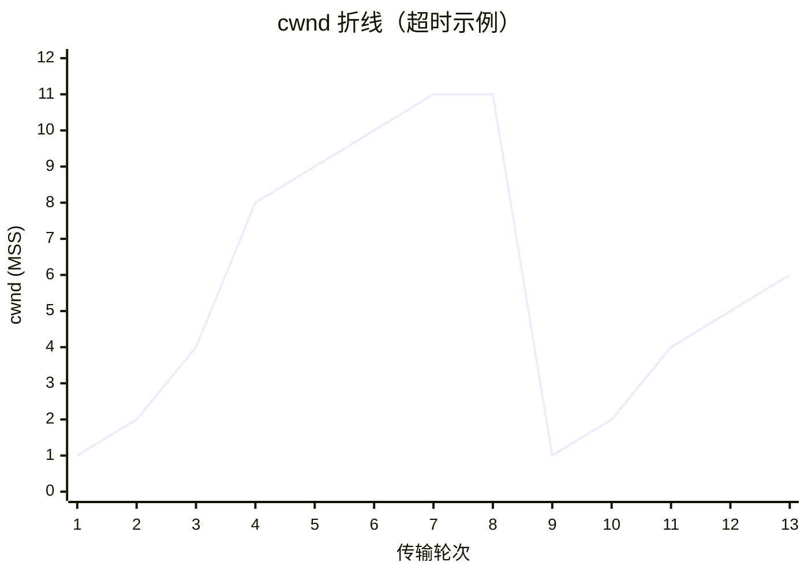

> **位置**：[总索引](/posts/872-index/)｜**上游**：[TCP 连接管理与流量控制](/posts/872-net-08-tcp-conn/)｜**下游**：[路由算法 RIP/OSPF/BGP](/posts/872-net-10-routing/)（10）

## 1. 本节考点与考法

| 考法问句 | 题型 | 频次 |
|---|---|---|
| 画出/分析整个传输过程中 cwnd 的变化折线 | 大题 | 极高频 |
| 慢开始与拥塞避免的门限 ssthresh 如何变化？ | 选择/大题 | 极高频 |
| 超时 vs 收到 3 个重复 ACK，处理有何不同？ | 简答/大题 | 高频 |
| 发送窗口 = ？（rwnd 与 cwnd 取小） | 计算 | 高频 |
| 拥塞控制与流量控制的区别？ | 简答 | 高频 |
| 四种算法各在什么条件下触发？ | 选择 | 高频 |

## 2. 知识框架

```
发送窗口 = min(rwnd, cwnd)   ← 流量控制限一边，拥塞控制限另一边

四算法联动（假定 rwnd 足够大，发送窗口 = cwnd）：
  ① 慢开始：cwnd=1 → 每 RTT 翻倍（指数增长）直到 ssthresh
  ② 拥塞避免：cwnd ≥ ssthresh → 每 RTT 加 1（线性增长）直到超时
  ③ 超时（重传计时器到期）：ssthresh = cwnd/2，cwnd = 1，重新慢开始
  ④ 快重传 + 快恢复（收到 3 个重复 ACK）：
     立即重传丢失段 → ssthresh = cwnd/2，cwnd = ssthresh（新值），进入拥塞避免
```

- cwnd 单位是 **MSS**（最大报文段长度），"cwnd=1"即 1 个 MSS
- 记忆主线：**指数爬到门限，线性爬到超时；超时打回 1，三重复 ACK 打回门限**

## 3. 简答与名词解释

### 必背

- **拥塞控制**：拥塞控制是防止过多的数据注入到网络中，使网络中的路由器或链路不致过载。它是一个**全局性**的过程，涉及所有主机、路由器；发送方通过维护**拥塞窗口 cwnd** 探测网络容量，发送窗口 = min(rwnd, cwnd)。TCP 的拥塞控制由**慢开始、拥塞避免、快重传、快恢复**四种算法配合完成。
- **慢开始**：连接建立或超时后，cwnd 从 1 个 MSS 起，**每经过一个 RTT，cwnd 加倍**（1→2→4→8…），指数增长；当 cwnd 达到慢开始门限 **ssthresh** 时，转入拥塞避免。"慢开始"的"慢"指起点低，不是增长速度慢。
- **拥塞避免**：cwnd ≥ ssthresh 后，**每经过一个 RTT，cwnd 只加 1 个 MSS**，线性缓慢增大。只要没有出现拥塞就持续增长；一旦**超时**判定网络拥塞：把 **ssthresh 更新为当前 cwnd 的一半**（乘法减），**cwnd 重置为 1**，重新开始慢开始。
- **快重传**：接收方收到失序报文段后**立即发送重复确认**（而不是等自己发送数据时捎带）。发送方**一连收到 3 个重复 ACK**，就立即重传对方尚未收到的那个报文段，而不必等重传计时器超时。快重传让发送方尽早发现个别报文段丢失，避免网络拥塞进一步加重。
- **快恢复**：与快重传配合使用。发送方收到 3 个重复 ACK 时（轻度拥塞，还能送达 ACK），执行：**ssthresh = 当前 cwnd / 2，cwnd = ssthresh（新值）**，直接进入**拥塞避免**阶段线性增长——不重置为 1、不走慢开始。这与超时的处理（cwnd=1 + 慢开始）形成鲜明对比。


_超时（严重拥塞）：cwnd 指数爬到 ssthresh(16) 后线性加 1；超时后 ssthresh 减半为 12、cwnd 打回 1 重新慢开始_


_3 个重复 ACK：ssthresh 与 cwnd 都减半，直接进拥塞避免（Reno）；Tahoe 则打回 1 走慢开始，已废弃_

### 辨析

- **拥塞控制 vs 流量控制**：流量控制是**端到端**问题，依据接收方通告的 rwnd，保护**接收方**；拥塞控制是**全局**问题，依据发送方推断的 cwnd，保护**网络**。二者都压低发送窗口：发送窗口 = min(rwnd, cwnd)。
- **超时 vs 3 个重复 ACK 的处理**：超时说明网络严重拥塞（连 ACK 都回不来），最激进地降窗——**ssthresh = cwnd/2，cwnd = 1，慢开始**；3 个重复 ACK 说明个别报文段丢失但网络仍通（后续段被收到并触发重复确认），轻度处理——**ssthresh = cwnd/2，cwnd = ssthresh，直接拥塞避免**。后者常称"乘法减、加法增"不重置起点。
- **TCP Tahoe vs TCP Reno（版本差异，易错）**：旧版 **TCP Tahoe（塔霍）**只有慢开始、拥塞避免和快重传，**没有快恢复**——即使收到 3 个重复 ACK 触发快重传，也按超时处理：ssthresh 减半、**cwnd 照样重置为 1**、从头慢开始；新版 **TCP Reno（里诺）**才引入**快恢复**——快重传后 ssthresh 与 cwnd 减半、cwnd 直接停在新门限上进入拥塞避免，不再回 1。本篇前述"三重复 ACK 不回 1"的处理均指 **Reno**（现行标准与考试默认版本），Tahoe 已废弃不用。
- **慢开始门限的两种来源**：初始 ssthresh 由具体实现设定（题目一般直接给定）；运行中每次发生拥塞（无论超时还是 3 重复 ACK），**ssthresh 都被更新为拥塞时 cwnd 的一半**。ssthresh 只在拥塞发生时下降，不会主动上升（考试范围内不考 RFC 5681 的 ssthresh 恢复细节）。
- **"乘法减、加法增"（AIMD）**：拥塞避免阶段每 RTT 线性加 1（加法增），出现拥塞窗口减半（乘法减）；这样既保证效率又保证收敛，是 TCP 拥塞控制的核心思想。

### 了解

- AQM 主动队列管理/RED：路由器在队列将满时随机提前丢包，让发送方提前减速（教材了解级）
- 发送方的发送窗口实际还受 rwnd 限制：若题目同时给 rwnd，发送窗口各时刻取 min(rwnd, cwnd)，折线会被"削顶"
- 拥塞判断的两种依据：超时（严重）与 3 个重复 ACK（轻度），是四算法切换的开关

## 4. 易混对比表

| 触发事件 | ssthresh | cwnd | 下一阶段 |
|---|---|---|---|
| 连接建立/初始 | 题目给定 | 1 | 慢开始 |
| cwnd = ssthresh | 不变 | 每 RTT +1 | 拥塞避免 |
| 超时 | 减半（=当时cwnd/2） | 重置 1 | 慢开始 |
| 3 个重复 ACK | 减半（=当时cwnd/2） | = 新 ssthresh | 拥塞避免（跳过慢开始，Reno） |

> Tahoe 版即便 3 个重复 ACK 也走 cwnd=1 慢开始；"跳过慢开始"仅 Reno 有快恢复时成立。

| 对比项 | 慢开始 | 拥塞避免 |
|---|---|---|
| 增长方式 | 每 RTT 翻倍（指数） | 每 RTT 加 1（线性） |
| 起始 cwnd | 1 | ssthresh |
| 结束条件 | cwnd ≥ ssthresh | 超时或 3 重复 ACK |

| 对比项 | 流量控制 | 拥塞控制 |
|---|---|---|
| 作用范围 | 端到端（一对收发方） | 全局（所有主机、路由器） |
| 保护对象 | 接收方 | 网络（链路/路由器缓存） |
| 依据 | rwnd（接收方通告） | cwnd（发送方推断） |
| 实现机制 | 滑动窗口 | 四算法 |

> 记法：折线题只认三个动作——**翻倍（慢开始）、加1（拥塞避免）、减半（遇到拥塞）**；减完之后，cwnd 是回 1 还是停在门限，看"超时还是三重复"。

## 5. 计算与方法

### ① cwnd 折线分析大题模板（本章压轴题型）

**触发条件**：给出初始 cwnd、初始 ssthresh、传输轮次中发生的事件（正常、超时、3 重复 ACK），要求写各轮 cwnd 或画折线。

**步骤**：
1. 列表逐轮推：cwnd < ssthresh → 翻倍；cwnd ≥ ssthresh → +1
2. "到达/超过 ssthresh"当轮即转入 +1（不双倍后再回退；872 常规处理：恰好等于门限就按拥塞避免 +1）
3. 发生**超时**的轮次：记下该轮 cwnd → ssthresh = cwnd/2，下一轮 cwnd = 1
4. 发生 **3 重复 ACK** 的轮次：ssthresh = cwnd/2，下一轮 cwnd = ssthresh
5. 有 rwnd 时每轮发送窗口 = min(rwnd, cwnd)，单独列一列

**自编例题**：初始 cwnd = 1，ssthresh = 8，rwnd 足够大。

| 轮次 | 事件 | cwnd（发送窗口） |
|---|---|---|
| 1 | 慢开始 | 1 |
| 2 | 翻倍 | 2 |
| 3 | 翻倍 | 4 |
| 4 | 翻倍 | 8 |
| 5 | =ssthresh，转拥塞避免 | 9 |
| 6 | +1 | 10 |
| 7 | +1 | 11 |
| 8 | **超时** → ssthresh=11/2=5 | （5） |
| 9 | cwnd=1，慢开始 | 1 |
| 10 | 翻倍 | 2 |
| 11 | 翻倍 | 4 |
| 12 | ≥ssthresh(5)，拥塞避免 | 5 |
| 13 | +1 | 6 |

若第 8 轮事件改为 **3 个重复 ACK**：ssthresh = 5，第 9 轮 cwnd 直接 = **5**，第 10 轮 6……不再回 1。



### ② 发送窗口取小计算

**触发条件**：同时给出 rwnd 与 cwnd。

**步骤**：发送窗口 = min(rwnd, cwnd)；逐轮比较，rwnd 小的轮次折线被压平在 rwnd 上。

**自编例题**：某轮 cwnd = 16，接收方通告 rwnd = 10 → 该轮发送窗口 = **10**；此后网络再拥塞、cwnd 降到 8，发送窗口 = min(10, 8) = **8**。

### ③ 轮次/时间换算

**触发条件**：问"经过多少 RTT 后 cwnd 首次达到某值"或"何时增长到 X"。

**步骤**：
1. 慢开始阶段：cwnd 按 2ᵏ 增长，k 为轮次；从 1 到 ssthresh 需 ⌈log₂ ssthresh⌉ 轮
2. 拥塞避免阶段：每轮 +1，从 ssthresh 到 X 需 X − ssthresh 轮
3. 总轮数相加；题目问时间再乘 RTT

**自编例题**：cwnd=1，ssthresh=16，RTT=10 ms。首次达到 cwnd=24：
慢开始 1→16 需 4 轮（1→2→4→8→16），拥塞避免 16→24 需 8 轮，共 **12 轮 = 120 ms**。

## 6. 本节易错点

常见坑：
- "慢开始是慢速增长"：错，是**起点慢（cwnd=1）但指数增长**，很快逼近门限
- "cwnd 达到 ssthresh 后继续翻倍到超时"：错，**等于门限当轮就转拥塞避免 +1**
- "3 个重复 ACK 也要把 cwnd 重置为 1"：错，重置 1 只发生在**超时**；三重复 ACK 走快恢复，cwnd = 新 ssthresh
- "Tahoe 版 3 个重复 ACK 也走快恢复、cwnd 不回 1"：错，**快恢复是 Reno 才引入的**；Tahoe 无快恢复，三重复 ACK 后照样 cwnd=1 慢开始（已废弃，考试默认 Reno）
- "ssthresh 一直不变"：错，**每次拥塞**（超时或三重复）都更新为拥塞时 cwnd 的一半
- "cwnd 单位是字节"：通常按 **MSS 个数**计（题目另有说明除外）
- "发送窗口永远等于 cwnd"：错，还要跟 rwnd 取小
- 折线图上超时当轮：cwnd 减半动作发生在**下一轮**生效，当轮仍按事件前的值处理（按题目约定，注意题干表述）
- "拥塞控制与流量控制是一回事"：错，全局 vs 端到端，cwnd vs rwnd

---
**出处汇总**：RFC 5681（TCP 拥塞控制）；RFC 9293；谢希仁《计算机网络（第7版）》第5章第8节（5.8 TCP 的拥塞控制）；王道计算机网络第5章拥塞控制
