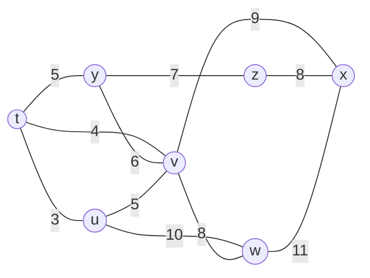
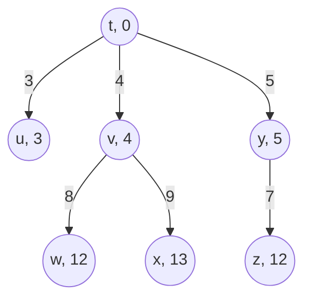

> **位置**：[总索引](/posts/872-index/)｜**上游**：[TCP 拥塞控制](/posts/872-net-09-congestion/)｜**下游**：[IP 与 CIDR](/posts/872-net-11-ip-cidr/)（11）

## 1. 本节考点与考法

| 考法问句 | 题型 | 频次 |
|---|---|---|
| RIP/OSPF/BGP 三协议多维度对比？ | 选择/简答 | 极高频 |
| 给出相邻路由器距离向量，更新路由表 | 大题/计算 | 极高频 |
| RIP 最大跳数 15/16 的含义？ | 选择 | 高频 |
| OSPF 五种分组类型？ | 选择/简答 | 高频 |
| RIP 坏消息传得慢（计数到无穷）怎么解决？ | 简答/选择 | 中频 |
| BGP 为什么用路径向量、找什么"可行"路由？ | 简答 | 中频 |

## 2. 知识框架

```
路由选择协议分两大类思想：
  距离向量 DV —— "把我的整张表告诉邻居"（RIP）
    ├─ 度量：跳数
    └─ 定期交换、分布计算：R_x(y) = min{ R_v(y) + c(x,v) }
  链路状态 LS —— "把我的邻居关系告诉全网"（OSPF）
    ├─ 度量：代价（带宽相关）
    └─ 泛洪链路状态通告 → 各节点全网拓扑 → Dijkstra 算路径
  路径向量 PV —— "把到达目的地的完整路径告诉邻居"（BGP）
    └─ 域间策略路由，避免 DV 的环路问题

内部网关协议 IGP（AS 内）：RIP、OSPF、IS-IS
外部网关协议 EGP（AS 之间）：BGP-4

RIP：UDP 520，应用层协议（借 UDP 传输）
OSPF：直接用 IP（协议号 89），自身可靠
BGP：TCP 179，应用层协议（借 TCP 传输）
```

- 考点提醒：RIP 和 BGP **名义上是应用层协议**（工作在应用层、借传输层传输），但功能是网络层的路由选择——放到本篇集中考

## 3. 简答与名词解释

### 必背

- **RIP（路由信息协议）**：RIP 是基于**距离向量算法**的内部网关协议，使用**跳数**作为度量，直连网络距离为 1，每经过一个路由器加 1，**最大跳数 15，16 表示不可达**。RIP 路由器**每 30 秒**向相邻路由器广播自己的整个路由表；只维护到每个目的网络的**最优（最短跳数）**路由。优点是简单，缺点是收敛慢、有"坏消息传得慢"问题、限制了网络规模。RIP 使用 UDP（端口 520）传送。
- **OSPF（开放最短路径优先）**：OSPF 是基于**链路状态算法**的内部网关协议，做事的路子是"先拼图、再算路"。每个路由器先摸清自己的直连邻居及各段链路代价，用**洪泛法（flooding）把这份链路状态通告 LSA 发给本 AS 内所有路由器**（不是只发邻居）。所有 LSA 汇总后，每个路由器都拿到一份**完全相同的全网链路状态数据库**，相当于人手一张本 AS 的拓扑地图；随后各路由器**独立运行 Dijkstra 最短路径算法**，算出以自己为根的最短路径树。正因为大家看的是同一张全局地图、各算各的，OSPF 一有变化便能快速收敛，也不会出现距离向量那种"坏消息传得慢"——代价是要洪泛、要存全网拓扑，通信与计算开销都大于 RIP。OSPF 还支持**划分区域**（层次路由）来控制规模，链路代价可与带宽挂钩。报文**直接封装在 IP 数据报中（协议字段 89）**、自带确认重传，不借传输层。
- **BGP-4（边界网关协议）**：BGP 是**外部网关协议**，用于**自治系统之间**的路由选择。BGP 力求找到一条**能够到达目的网络且比较好的路由（不兜圈子）**，而非最佳路由；采用**路径向量算法**，路由条目携带完整的 AS 路径序列，能据此避免环路并执行策略。BGP 建立 **TCP（端口 179）** 连接交换路由信息，只在变化时增量更新，适合大规模网络。
- **距离向量算法（DV）**：每个节点把整张距离向量表周期性地发给**邻居**；收到邻居的表后，按 **R_x(y) = min_v{ c(x,v) + R_v(y) }** 重新计算到各目的网络的距离，取更优者更新表项并记录下一跳。优点是简单、开销小；缺点是收敛慢，坏消息传播慢（计数到无穷大问题）。
- **链路状态算法（LS）**：三步：①各节点发现邻居、测量链路代价；②用**洪泛法**把 LSA 发给**全网所有节点**；③每个节点据此建立全网拓扑图，运行 **Dijkstra** 单源最短路径算法得到路由。收敛快、全局视野，代价是计算与存储开销大。

### 辨析

- **RIP vs OSPF**：算法——DV vs LS；度量——跳数 vs 代价；交换对象——邻居 vs 全网；交换内容——整张路由表 vs 链路状态通告；传输——UDP 520 vs IP(89)；收敛——慢 vs 快；规模——小网络 vs 大网络/分区。
- **RIP vs BGP**：范围——AS 内 vs AS 间；算法——DV vs 路径向量；目标——最小跳数 vs 可行（符合策略、无环）路由；传输——UDP vs TCP 179。
- **OSPF vs BGP**：OSPF 解决"AS 内怎么走最快"，BGP 解决"AS 之间怎么走可行"；OSPF 看重代价最优，BGP 看重策略可控（政治、安全、计费）。
- **坏消息传得慢（计数到无穷）**：链路断开时，经 A→B→…的旧路径信息仍在网内循环刷新，距离逐次 +1 缓慢攀升到 16 才判不可达。缓解：**水平分割**（不从学来该路由的接口再通告回去）、**毒性逆转**（把该路由以 16 反向通告）。
- **IGP vs EGP**：IGP 在一个 AS 内部使用，追求路由最优与收敛速度；EGP 连接不同 AS，受各 AS 策略约束，先保证可达与可控，再谈最优。

### 了解

- OSPF 五种分组类型：问候（Hello，10s 周期建立/维持邻接）、数据库描述（DD）、链路状态请求（LSR）、链路状态更新（LSU）、链路状态确认（LSAck）
- OSPF 划分区域：主干区域 0.0.0.0，区域边界路由器 ABR、AS 边界路由器 ASBR
- RIP 的 30s/180s/6×30s：每 30s 广播；180s 未收到某路由器报文则标记不可达；超 6 个周期删除

## 4. 易混对比表

| 对比项 | RIP | OSPF | BGP-4 |
|---|---|---|---|
| 类型 | 内部 IGP | 内部 IGP | 外部 EGP |
| 算法 | 距离向量 | 链路状态 + Dijkstra | 路径向量 |
| 度量 | 跳数（≤15） | 代价 | 策略 + AS 路径 |
| 交换范围 | 相邻路由器 | 全 AS（洪泛） | 邻居 AS（BGP 邻居） |
| 交换内容 | 整张路由表 | LSA 链路状态 | 到目的网络的 AS 路径 |
| 交换时机 | 周期 30s | 触发式（变化时） | 增量（变化时） |
| 下层承载 | UDP 520 | IP 协议号 89 | TCP 179 |
| 收敛速度 | 慢 | 快 | 慢（策略协商） |
| 环路避免 | 16 限跳 | 拓扑图天然无环 | AS 路径检测 |

| DV vs LS | 距离向量 | 链路状态 |
|---|---|---|
| 告诉谁 | 邻居 | 全网 |
| 告诉什么 | 我的整张距离表 | 我的邻居与链路代价 |
| 计算位置 | 各节点分布式迭代 | 每节点独立跑 Dijkstra |
| 收敛 | 慢（坏消息传得慢） | 快 |
| 资源开销 | 通信少、计算少 | 通信多（洪泛）、计算多 |

> 记法：RIP "**邻居整表 30 秒**"；OSPF "**全网链路 Dijkstra**"；BGP "**AS 之间走 TCP 找可行**"。传输方式记忆：R-I-P 走 UDP，B-G-P 走 TCP，O-S-P-F 自己走 IP。

## 5. 计算与方法

### ① 距离向量路由表更新（本章压轴计算）

**触发条件**：给出路由器 X 当前路由表 + 邻居发来的距离向量，求更新后的路由表。

**更新规则（三句话）**：
1. 把邻居发来的向量**各项加 1**（到邻居的跳数）：R_v(y) + 1
2. 逐项与 X 原表比较：
   - 原表**没有**该目的网络 → **新增**：距离 = 新值，下一跳 = 该邻居
   - 原表**下一跳就是该邻居** → **无条件替换**（哪怕变大了，因为原路由就来自这条路）
   - 新距离**更小** → **替换**：距离 = 新值，下一跳 = 该邻居
3. 其余项不变

**自编例题**：路由器 R 的当前路由表与邻居 G 发来的向量如下。

| 目的网络 | R 原距离 | 下一跳 |
|---|---|---|
| N1 | 2 | A |
| N2 | 5 | G |
| N3 | 7 | F |
| N4 | 4 | G |

G 的向量：N1=3, N2=2, N3=4, N4=8。G 的向量各项 +1：N1=4, N2=3, N3=5, N4=9。

逐项处理：
- N1：新 4 vs 原 2，下一跳 A≠G，4>2 不更新 → **保持 2, A**
- N2：下一跳是 G → **无条件更新为 3, G**
- N3：新 5 vs 原 7，5<7 → **更新为 5, G**
- N4：下一跳是 G → **无条件更新为 9, G**

更新后：N1=2(A), N2=3(G), N3=5(G), N4=9(G)。

**易错**：N4 变大也必须更新——"下一跳是发来向量的邻居"时没有比较资格；这是本题型第一失分点。

**例题 2（RIP 路由表更新）**：R1、R2、R3、R4 是 4 台运行 RIP 距离向量路由算法的路由器，互相之间交换路由表。假设路由器 R1 在构建路由表时采用的是距离向量算法（RIP），它收到从 R2、R3、R4 传来的路由表如下：

| 路由器 R2 的路由表 |  | 路由器 R3 的路由表 |  | 路由器 R4 的路由表 |  |
|---|---|---|---|---|---|
| 目的 | 延迟 | 目的 | 延迟 | 目的 | 延迟 |
| R1 | 2 | R1 | 3 | R1 | 1 |
| R2 | 0 | R2 | 3 | R2 | 2 |
| R3 | 3 | R3 | 0 | R3 | 2 |
| R4 | 2 | R4 | 2 | R4 | 0 |
| E | 3 | E | 1 | E | 2 |
| F | 5 | F | 3 | F | 3 |

更新前 R1 的本地路由表如下：

| 目的 | 延迟 | 后继路由器 |
|---|---|---|
| R1 | 0 | R1 |
| R2 | 2 | R2 |
| R3 | 5 | R3 |
| R4 | 1 | R4 |
| E | ∞ | — |
| F | 8 | R3 |

**问题 1**：请更新 R1 的路由表，填写更新后的目的、延迟、后继路由器。

| 目的 | 延迟 | 后继路由器 |
|---|---|---|
| R1 | 0 |  |
| R2 | 2 |  |
| R3 |  |  |
| R4 | 1 |  |
| E |  |  |
| F |  |  |

**解**：RIP 更新时，先把邻居路由表里的延迟各项加上 R1 到该邻居的直连延迟。由 R1 原表可知 R1–R2 = 2、R1–R3 = 5、R1–R4 = 1，于是：

- R2 的路由表各项 +2：R1=4、R2=2、R3=5、R4=4、E=5、F=7
- R3 的路由表各项 +5：R1=8、R2=8、R3=5、R4=7、E=6、F=8
- R4 的路由表各项 +1：R1=2、R2=3、R3=3、R4=1、E=3、F=4

逐目的取最小，并按规则处理"原下一跳就是发来路由表的邻居"：

| 目的 | R2 表 +2 | R3 表 +5 | R4 表 +1 | 取值 |
|---|---|---|---|---|
| R1 | 4 | 8 | 2 | 0, R1（本机） |
| R2 | 2 | 8 | 3 | 2, R2 |
| R3 | 5 | 5 | 3 | **3, R4** |
| R4 | 4 | 7 | 1 | 1, R4 |
| E | 5 | 6 | 3 | **3, R4** |
| F | 7 | 8 | 4 | **4, R4** |

更新后 R1 的路由表：

| 目的 | 延迟 | 后继路由器 |
|---|---|---|
| R1 | 0 | R1 |
| R2 | 2 | R2 |
| R3 | 3 | R4 |
| R4 | 1 | R4 |
| E | 3 | R4 |
| F | 4 | R4 |

**易错**：R3 原为"5, R3"（直连），但经 R4 只有 3，必须改走 R4；F 同样由 8 降到 4。只有原下一跳就是发来路由表的邻居（本题的 R2、R4）才无条件接受对方的值，哪怕数值变大。

### ② 计数到无穷分析

**触发条件**：链路断开后问若干轮交换后的距离值。

**步骤**：
1. 断链两端直接距离设 16（不可达）
2. 无缓解措施时，其他路由器按旧向量逐轮 +1：每 30s 一轮，距离 = 16 前每轮加 1
3. 有毒性逆转：断链反向通告 16，下一轮即收敛

**自编例题（计数到无穷）**：R1 直连网络 X（延迟 1），R2 经 R1 到达 X（延迟 2），R1–R2 链路延迟 1。现 R1 到 X 的链路断开。

- R1 发现直连链路断，把 X 的距离置为 16（不可达）；R2 尚未察觉，仍向 R1 通告"X = 2"。
- R1 收到后按 2 + 1 = 3 计算，3 < 16，误以为可经 R2 到达 X，把 X 改为"3, R2"。
- 下一轮 R2 收到 R1 通告的 X = 3，按 3 + 1 = 4 改为"4, R1"；再下一轮 R1 收到 4 改为 5……如此往复，两个路由器的 X 距离每轮各 +1，从 3 一直涨到 16 才判不可达。

| 交换轮次 | R1 的 X（后继） | R2 的 X（后继） |
|---|---|---|
| 断链前 | 1（直连） | 2（R1） |
| 检测到断链 | 16（—） | 2（R1） |
| 第 1 轮 | 3（R2） | 2（R1） |
| 第 2 轮 | 3（R2） | 4（R1） |
| 第 3 轮 | 5（R2） | 4（R1） |
| 第 4 轮 | 5（R2） | 6（R1） |
| 第 5 轮 | 7（R2） | 6（R1） |
| 第 6 轮 | 7（R2） | 8（R1） |
| 第 7 轮 | 9（R2） | 8（R1） |
| 第 8 轮 | 9（R2） | 10（R1） |
| 第 9 轮 | 11（R2） | 10（R1） |
| 第 10 轮 | 11（R2） | 12（R1） |
| 第 11 轮 | 13（R2） | 12（R1） |
| 第 12 轮 | 13（R2） | 14（R1） |
| 第 13 轮 | 15（R2） | 14（R1） |
| 第 14 轮 | 15（R2） | 16（—） |
| 第 15 轮 | 16（—） | 16（—） |

RIP 每 30 s 交换一次，约 15 轮即 7.5 min 才收敛，这就是"坏消息传得慢"。若启用**毒性逆转**（R1 断链后把 X 以 16 反向通告给 R2），R2 收到 16 + 1 = 17，按不可达处理，立即把 X 置 16，一轮即收敛；**水平分割**（R2 不把从 R1 学来的 X 再通告回 R1）也能从源头避免这次来回刷新。

### ③ OSPF 最短路径（Dijkstra 手算）

**触发条件**：给出链路代价图，求某节点到各网络的最短路径与下一跳。

Dijkstra 算法维护一个已确定节点集 S 和每个节点的距离估计值 dist，初始时 S 只含源点。每轮从 V−S 中取出 dist 最小的节点 u 加入 S，即认为 u 的最短距离已最终确定；随后以 u 为中间节点对它的每个邻居 v 做**松弛**：若 dist(u) + w(u,v) < dist(v)，则令 dist(v) = dist(u) + w(u,v)，并把 v 的**来源**记为 u。这种"取 dist 最小者即定案"的正确性依赖链路代价非负：若源点到 u 的最短路径经过 V−S 中的节点，设它离开 S 后首先到达 x，则该路径在 x 之前的部分只经过 S 内节点，长度不小于当前的 dist(x)；又 u 是 V−S 中 dist 的最小者，故 dist(x) ≥ dist(u)；再加上 x 之后各段代价非负，路径总长不可能小于 dist(u)。因此每轮可安全确定一个节点，除源点外尚有 n−1 个节点，至多 n−1 轮后全部节点的最短距离与来源确定。

**步骤**：
1. 初始化：源点距离记 0（已确定），其直连邻居距离记为该链路代价、来源记为源点，其余节点距离记 ∞
2. **选点**：在未确定节点中挑距离最小者，标记为已确定
3. **松弛**：用这个新确定的节点逐个检查它的邻居——若「该节点距离 + 链路代价」小于邻居现有距离，就更新邻居距离并把来源改成它
4. 重复 2~3 直到全部确定；沿每个节点的"来源"回溯即得最短路径，来源链的首段就是路由表里的下一跳

**自编例题**：以 R1 为源，链路代价为 R1—R2 = 2、R1—R3 = 5、R2—R3 = 3、R2—R4 = 4、R3—R4 = 2、R4—R5 = 1，求 R1 到各路由器的最短距离。

| 轮次 | 确定节点 | 松弛后各节点暂定距离（来源） |
|---|---|---|
| 初始 | R1 = 0 | R2 = 2（R1）、R3 = 5（R1）、R4 = ∞、R5 = ∞ |
| 第 1 轮 | R2 = 2 | R3 = 5（R1）、R4 = 6（R2）、R5 = ∞ |
| 第 2 轮 | R3 = 5 | R4 保持 6（R2）（经 R3 为 5+2=7，不更新）、R5 = ∞ |
| 第 3 轮 | R4 = 6 | R5 = 7（R4） |
| 第 4 轮 | R5 = 7 | — |

最终：R2 = 2（下一跳 R2）、R3 = 5（下一跳 R3）、R4 = 6（路径 R1→R2→R4）、R5 = 7（路径 R1→R2→R4→R5）。

两个容易踩的地方：一是 R3 直连 5 与经 R2 的 2+3=5 打平，取谁都行、不影响结果，但 R4 别想当然按 5+2 走——从 R3 绕是 7，反倒不如 R2 给的 6 短；二是路由表的"下一跳"看的是**来源链**，不是邻居里谁离得近。若题目把目的写成挂在某路由器后的网络（如 N3 挂在 R3 后、再花代价 1），只需在算出到该路由器的距离后加上这段网络代价即可。

### ④ 七节点 Dijkstra 综合例题（拓扑 + 填表 + 最短路径树 + 转发表）

**题**：下图是由 7 台路由器组成的无向带权连通网络，链路旁的数字为链路开销；源点为 `t`，用 Dijkstra 算法求 t 到其余各节点的最短路径。



记法：N′ 为已确定最短路径的节点集合；D(·) 为源点 t 到该节点的当前最短距离；p(·) 为该节点的前驱（上一跳）；∞ 表示当前不可达。

**（1）逐步填表（第 1 步已给出）**

| 步骤 | N′ | D(x), p(x) | D(u), p(u) | D(v), p(v) | D(w), p(w) | D(y), p(y) | D(z), p(z) |
|---|---|---|---|---|---|---|---|
| 1 | t | ∞ | 3, t | 4, t | ∞ | 5, t | ∞ |
| 2 | t, u | ∞ | 3, t | 4, t | 13, u | 5, t | ∞ |
| 3 | t, u, v | 13, v | 3, t | 4, t | 12, v | 5, t | ∞ |
| 4 | t, u, v, y | 13, v | 3, t | 4, t | 12, v | 5, t | 12, y |
| 5 | t, u, v, y, w | 13, v | 3, t | 4, t | 12, v | 5, t | 12, y |
| 6 | t, u, v, y, w, z | 13, v | 3, t | 4, t | 12, v | 5, t | 12, y |
| 7 | t, u, v, y, w, z, x | 13, v | 3, t | 4, t | 12, v | 5, t | 12, y |

第 5、6 步的说明：w 与 z 的距离同为 12，先确定谁都行。第 5 步取 w，松弛邻居 x 得 12+11=23，大于 x 现有的 13，不更新；第 6 步取 z，松弛 x 得 12+8=20，仍大于 13，也不更新。

**（2）源点 t 的最短路径树**

| 目的 | 最短距离 | 最短路径 | 前驱 p |
|---|---|---|---|
| u | 3 | t → u | t |
| v | 4 | t → v | t |
| y | 5 | t → y | t |
| w | 12 | t → v → w | v |
| z | 12 | t → y → z | y |
| x | 13 | t → v → x | v |



**（3）节点 t 的转发表**

| 目的 | 下一跳 |
|---|---|
| u | u |
| v | v |
| y | y |
| w | v |
| z | y |
| x | v |

## 6. 本节错题与易错点

- [ ] 待填：今日王道距离向量计算错因

常见坑：
- "OSPF 用 UDP 传输"：错，OSPF **直接封装在 IP 数据报**中（协议号 89），自带确认重传机制；RIP 用 UDP 520，BGP 用 TCP 179
- "RIP 的 16 表示跳数为 16 的网络可达"：错，16 = **不可达**，可用网络最大 15 跳
- "更新时新距离变大就不替换"：错——当**原表下一跳就是该邻居**时无条件替换；只有下一跳不同的项才比较大小
- "RIP 是网络层协议"：错，RIP 借 UDP 传输，是**应用层**协议（BGP 同理），只是功能服务于网络层；OSPF 才直接算网络层
- "OSPF 向全网发送整张路由表"：错，发送的是**链路状态通告 LSA**（邻居与代价），不是路由表；发整表的是 RIP（且只发邻居）
- "BGP 找最佳路由"：错，找**可行**（策略允许、无环、较好）路由，AS 间有策略与计费因素
- "距离向量比链路状态收敛快"：反了，LS 收敛快；DV 慢在坏消息
- 手算 Dijkstra 漏松弛：每加入一个节点必须检查所有邻居距离是否缩短，漏一步整题偏

---
**出处汇总**：RFC 2453（RIP v2）、RFC 2328（OSPF v2）、RFC 4271（BGP-4）；谢希仁《计算机网络》第4章第5节；王道计算机网络第4章路由协议
