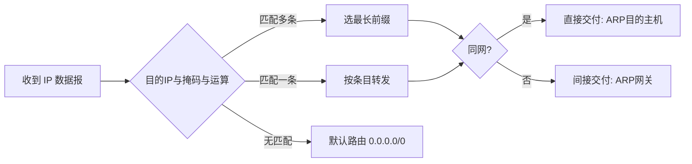

> **位置**：[总索引](/posts/872-index/)｜**上游**：[路由算法 RIP/OSPF/BGP](/posts/872-net-10-routing/)｜**下游**：[IP分片 + ARP + ICMP](/posts/872-net-12-fragment-arp/)（12）

## 1. 本节考点与考法

| 考法问句 | 题型 | 频次 |
|---|---|---|
| 给定网络划分若干子网，写出各子网地址/掩码/范围 | 大题 | 极高频 |
| 判断某 IP 属于哪个子网（最长前缀匹配） | 选择/大题 | 极高频 |
| CIDR 聚合：几个地址块合并成一个前缀 | 计算/选择 | 高频 |
| A/B/C 类地址范围、私有地址段辨析 | 选择 | 高频 |
| IP 首部各字段作用（TTL、协议字段等） | 选择/简答 | 高频 |
| 主机数/子网数计算（减 2 问题） | 计算 | 高频 |

## 2. 知识框架

```
IP 地址 = 网络号 + 主机号（分类）→ 网络前缀 + 主机号（CIDR）

分类地址（传统）：
  A 类 0xxxxxxx：1~126，      /8， 网络数 126，       主机 2²⁴−2
  B 类 10xxxxxx：128~191，    /16，网络数 2¹⁴，       主机 2¹⁶−2
  C 类 110xxxxx：192~223，    /24，网络数 2²¹，       主机 2⁸−2
  （D 类 224~239 组播，E 类 240~255 保留）

特殊地址：
  0.0.0.0        本机（作为源地址）
  255.255.255.255  受限广播（本网络）
  主机号全 0       网络地址本身（不能分配主机）
  主机号全 1       直接广播（向该网络所有主机）
  127.x.x.x      环回测试

私有地址（不进公网，NAT 出口）：
  10.0.0.0/8、172.16.0.0/12、192.168.0.0/16

CIDR：无类别域间路由
  地址块记法 a.b.c.d/n，掩码左边 n 个 1
  聚合：取共同前缀（最长公共前缀）
  路由匹配：最长前缀匹配原则

IP 首部 20B 固定部分关键字段：
  版本 | 首部长度(4B单位) | 总长度(1B单位) | TTL | 协议(1=ICMP,6=TCP,17=UDP) | 首部校验和 | 源/目的 IP
```

## 3. 简答与名词解释

### 必背

- **子网掩码**：子网掩码是 32 位二进制数，**网络部分全 1、主机部分全 0**，用于与 IP 地址按位"与"运算提取网络地址。路由器和主机据此判断目的主机是否在同一网络：同网直接交付，异网交给默认网关。CIDR 下掩码可任意长度（斜线记法 /n）。
- **子网划分**：从主机号**借用若干位**作为子网号，把一个大网络划分为多个小网络对外仍表现为一个网络。划分后地址结构 = 网络号 + 子网号 + 主机号；子网数为 2^借用位数（全 0 全 1 子网如今可用），每个子网可用主机数 = 2^剩余主机位数 − 2（全 0 网络地址、全 1 广播地址不能分配）。
- **CIDR（无分类编址）**：CIDR 消除 A/B/C 类概念，把 IP 地址分为**网络前缀 + 主机号**两部分，记法 a.b.c.d/n，/n 表示前缀位数。CIDR 把前缀相同的连续地址组成**地址块**，支持**路由聚合**（把多个小网络合并通告为一个大块），大幅缩小路由表规模，缓解地址枯竭。
- **最长前缀匹配**：路由表查到**多个匹配条目**时，选择**网络前缀最长**的那条转发。前缀越长地址块越小、路由越具体。原因：CIDR 聚合产生"大块包含小块"，必须走更具体的条目才能到达正确的子网。
- **IP 数据报首部关键字段**：①**首部长度**：以 4 B 为单位，最小 5（20 B）、最大 15（60 B）；②**总长度**：首部+数据，以 1 B 为单位（联动 12 篇分片计算）；③**TTL**：每过一个路由器减 1，为 0 丢弃并回 ICMP 超时——防环+ traceroute 原理；④**协议字段**：标识上层，1=ICMP、6=TCP、17=UDP；⑤**首部校验和**：只校验首部，每过一路由器重算。

### 辨析

- **直接交付 vs 间接交付**：目的 IP 与源 IP 在同一网络（掩码与后相同）→ 直接交付（ARP 找目的 MAC，联动 12 篇）；不在同一网络 → 间接交付，交给路由器（ARP 找**默认网关**的 MAC）。判断依据永远是"掩码与运算后的网络地址是否相同"。
- **网络地址 vs 广播地址**：主机号全 0 是网络地址（代表网络本身，不能配给主机）；主机号全 1 是直接广播地址（向本网络所有主机发送）。受限广播 255.255.255.255 只在本网络内泛洪，路由器不转发。
- **私有地址 vs NAT**：私有地址三段（10/8、172.16/12、192.168/16）只在机构内部使用，不出现在公网；内网主机访问外网由 NAT 路由器把私有源地址转换为公网地址（端口映射），路由器对目的地址是私有地址的包不转发。
- **聚合 vs 划分**：划分是"借位"——主机号左移变成子网号，前缀变长；聚合是"缩位"——多个块取公共前缀，前缀变短。方向相反，计算同源：都盯着二进制前缀。
- **A 类 127 vs 0 网段**：127/8 环回测试不进网络；0.0.0.0 表示"本机/默认路由"；这两个 + 主机号全 0/全 1 都**不能分配给主机**——数"可用主机数"时逐项排除。

### 了解

- IPv4 地址耗尽的对策：CIDR、NAT、IPv6（128 位，联动课外）
- IP 首部可选字段（记录路由、时间戳）与填充（首部必须 4 B 对齐）
- 分类的 2^7−2 等：A 类网络号 8 位但首位固定 0，去掉 0 和 127，可用网络 126 个

## 4. 易混对比表

| 类别 | 首位模式 | 第一字节范围 | 默认掩码 | 最大主机数 |
|---|---|---|---|---|
| A | 0 | 1~126 | /8（255.0.0.0） | 2²⁴−2 ≈ 1677 万 |
| B | 10 | 128~191 | /16（255.255.0.0） | 2¹⁶−2 = 65534 |
| C | 110 | 192~223 | /24（255.255.255.0） | 2⁸−2 = 254 |
| D | 1110 | 224~239 | 组播地址 | — |
| E | 1111 | 240~255 | 保留 | — |

| 私有地址段 | 范围 | 对应 CIDR |
|---|---|---|
| 10/8 | 10.0.0.0 ~ 10.255.255.255 | 10.0.0.0/8 |
| 172.16/12 | 172.16.0.0 ~ 172.31.255.255 | 172.16.0.0/12 |
| 192.168/16 | 192.168.0.0 ~ 192.168.255.255 | 192.168.0.0/16 |

| 特殊 IP | 含义 | 能否作源 | 能否作目的 |
|---|---|---|---|
| 0.0.0.0 | 本机（DHCP 请求源） | 能 | 否 |
| 255.255.255.255 | 受限广播 | 否 | 能 |
| 主机号全 0 | 网络地址 | 否 | 否 |
| 主机号全 1 | 直接广播 | 否 | 能 |
| 127.0.0.1 | 环回 | 能 | 能 |

> 记法：私有段口诀"**10 一段、172 十六到三十一、192 点 168**"；主机数计算先写 2^k，再**减 2**；第一字节判类看**前几位 1 的个数**（0/10/110/1110/1111）。

## 5. 计算与方法

### ① 子网划分大题模板（本章压轴）

**触发条件**：给定一个网络地址和要求划分的子网数（或各子网主机数），求各子网的网络地址、掩码、可用范围。

**步骤**：
1. 由子网数 N 求借用位数 m：2^m ≥ N；由每子网主机数 H 求主机位 k：2^k − 2 ≥ H
2. 检查约束：m + 原主机位够不够分（借位后主机位 = 原主机位 − m ≥ k）
3. 新掩码 = 原前缀 + m；每个子网**按块地址递增 2^k** 排列
4. 每个子网写三件套：网络地址（主机位全 0）、广播地址（主机位全 1）、可用范围（中间部分）
5. 若题目给的是"最大子网优先/依次分配"，按从大到小排块，避免重叠

**自编例题**：把 192.168.1.0/24 划分为 4 个子网。
- 2^m ≥ 4 → m = 2，新前缀 /26，掩码 255.255.255.192
- 块大小 = 2^6 = 64：

| 子网 | 网络地址 | 可用范围 | 广播地址 |
|---|---|---|---|
| 1 | 192.168.1.0/26 | .1 ~ .62 | 192.168.1.63 |
| 2 | 192.168.1.64/26 | .65 ~ .126 | 192.168.1.127 |
| 3 | 192.168.1.128/26 | .129 ~ .190 | 192.168.1.191 |
| 4 | 192.168.1.192/26 | .193 ~ .254 | 192.168.1.255 |

### ② CIDR 聚合

**触发条件**：给若干连续地址块，求最小聚合块。

**步骤**：
1. 全部写成二进制，**上下对齐找公共前缀**
2. 公共前缀位数 n → 聚合为 a.b.c.d/n
3. 检验：聚合块大小 = 各块之和（若偏大说明有空洞，聚合不精确，但考题一般要求"最小公共前缀"）

**自编例题**：聚合 206.1.0.0/17 与 206.1.128.0/17。
两块只有第 17 位不同（0 与 1），公共前缀 16 位 → **206.1.0.0/16**。

**自编例题 2**：聚合 192.168.4.0/24 ~ 192.168.7.0/24（4 个连续 C 块）。
第 3 字节 4,5,6,7 = 000001xx，公共前缀到第 22 位 → **192.168.4.0/22**。

### ③ 最长前缀匹配

**触发条件**：路由表多条目 + 目的 IP，问转发到哪个下一跳。

**步骤**：
1. 目的 IP 与每条掩码做"与"运算
2. 与该条目网络地址**相同**者入选（可多条）
3. 取**前缀最长**的那条 → 按其下一跳转发
4. 无任何匹配 → 交给默认路由 0.0.0.0/0

**自编例题**：路由表：①192.168.20.0/24 → R1；②192.168.20.16/28 → R2；③0.0.0.0/0 → R3。收到目的地址 192.168.20.18：
- 与①与运算 = 192.168.20.0 匹配（/24）
- 与②与运算 = 192.168.20.16 匹配（/28）
- /28 > /24 → **走 R2**（更具体的条目优先）

### ④ 主机数/子网数速算

**触发条件**：给前缀长度求可用主机数，或反推前缀。

**步骤**：
1. 主机位 k = 32 − 前缀 n；可用主机 = 2^k − 2
2. 常用值背下来：/24→254，/25→126，/26→62，/27→30，/28→14，/29→6，/30→2
3. /31 点对点特殊（RFC 3021，考试一般不考）；/32 单机路由

### ⑤ IP 首部选择/简答要点

- 首部长度字段单位 4 B、总长度字段单位 1 B、TTL 单位是"跳"
- 协议字段 1/6/17 ↔ ICMP/TCP/UDP（联动 12 篇 ICMP）
- 首部校验和只保首部且逐跳重算（TTL 每跳变）
- 分片相关字段（标识、标志 DF/MF、片偏移 8 B 单位）在 12 篇展开



## 6. 本节错题与易错点

- [ ] 待填：今日王道子网划分错因

常见坑：
- "可用主机数 = 2^k"：错，**减 2**（网络地址 + 广播地址）
- "A 类网络数 128"：错，去掉 0 网段和 127 环回，是 **126**
- "192.168.20.0/24 下 192.168.20.255 不能用"：对（主机号全 1 广播）；但 /26 时 .127、.191 等也是各子网广播，别只盯 .255
- "掩码越长相匹配的网络越大"：反了，**掩码越长 → 前缀越长 → 块越小、越具体**
- "聚合后块大小一定等于各块之和"：只有各块对齐在同一父块内才成立，否则按"最小公共前缀"聚合（可能略大）
- "私有地址不能出现在互联网上"：对——路由器**不转发**目的为私有地址的分组，NAT 出口转换
- "TTL 减为 0 立即丢弃且不通知源"：错，回送 **ICMP 时间超过**报文（traceroute 就靠它）
- 单位换算坑：首部长度 ×4 B、总长度 ×1 B、片偏移 ×8 B（12 篇细化）

---
**出处汇总**：RFC 791（IP）、RFC 4632（CIDR）、RFC 1918（私有地址）；谢希仁《计算机网络》第4章第3、4、6节；王道计算机网络第4章网络层
